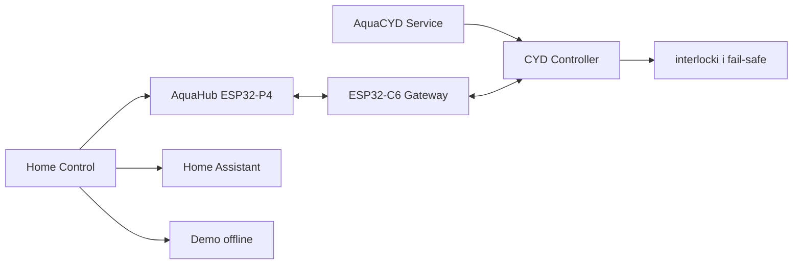

# Home Control + AquaCYD

Monorepo zawiera uniwersalny panel domu **Home Control**, osobną aplikację serwisową **AquaCYD Service**, autonomiczny sterownik akwarium CYD, lokalny AquaHub ESP32-P4, bramkę ESP32-C6 oraz opcjonalne integracje. Home Assistant jest jednym ze źródeł danych, a nie warunkiem działania systemu ani nazwą aplikacji.

## Architektura w skrócie

- CYD samodzielnie steruje sprzętem i pozostaje jedynym źródłem prawdy dla GPIO, harmonogramów, alarmów, blokad i fail-safe.
- Home Control łączy cały dom przez wymienne adaptery AquaHub, Home Assistant i Demo.
- AquaCYD Service zapewnia bezpośredni serwis REST/BLE, provisioning, odzyskiwanie, kalibrację i kontrolowane OTA CYD.
- ESP32-P4 działa jako siedmiocalowy panel LVGL i lokalny AquaHub; ESP32-C6 jest mostem ESP-NOW/Wi-Fi.
- Home Assistant, MQTT, brama zdalna i Raspberry Pi są opcjonalne. CYD ani P4 nie są wystawiane bezpośrednio do Internetu.



## Struktura

| Ścieżka | Odpowiedzialność |
| --- | --- |
| `apps/home_control/` | natywna aplikacja całego domu |
| `apps/aquacyd_service/` | aplikacja serwisowa sterownika akwarium |
| `firmware/cyd_controller/` | autonomiczny firmware PlatformIO dla CYD |
| `firmware/esp32p4_hub/` | panel LVGL i AquaHub w ESP-IDF |
| `firmware/esp32c6_gateway/` | bramka radiowa w ESP-IDF |
| `firmware/shared/` | współdzielone, wersjonowane kontrakty C++ |
| `services/remote_gateway/` | opcjonalna brama HTTPS/FCM |
| `integrations/home_assistant/` | pakiet, dashboard i ACL Home Assistant |
| `web/`, `sdcard/` | źródła panelu web i pakiet dla urządzenia |
| `packages/` | współdzielone pakiety Dart |
| `design/`, `docs/`, `tools/`, `scripts/` | projekty UI, dokumentacja i automatyzacja |

## Szybki start

Home Control w bezpiecznym trybie Demo:

```powershell
cd apps/home_control
flutter pub get
flutter run -d chrome
```

AquaCYD Service:

```powershell
cd apps/aquacyd_service
flutter pub get
flutter run
```

Sterownik CYD i testy domenowe:

```powershell
pio run -d firmware/cyd_controller -e native -t test
pio run -d firmware/cyd_controller -e esp32dev
```

ESP32-P4 i ESP32-C6 z przypiętym ESP-IDF 5.4.4:

```powershell
.\tools\build-p4-c6.ps1 -IdfPath C:\esp\v5.4.4-full\esp-idf
```

Panel web i testy Node.js:

```powershell
npm ci
npm test
npm run test:e2e
```

## Bezpieczeństwo i wydania

Firmware produkcyjny akceptuje podpisane pakiety, a klucze podpisu pozostają w chronionym środowisku CI. Repozytorium nie zapisuje sekretów, nie przepala eFuse i nie uznaje mocków za test sprzętowy. Aktualizacje Home Control, AquaCYD Service, CYD, P4 i C6 mają osobne zgodności, statusy i procesy publikacji.

Aktualne źródła prawdy:

- [specyfikacja produktów](docs/PRODUCT_SPEC.md),
- [architektura monorepo](docs/MONOREPO_ARCHITECTURE.md),
- [audyt bazowy](docs/BASELINE_AUDIT.md),
- [plan migracji](docs/MIGRATION_PLAN.md),
- [bezpieczeństwo runtime CYD](docs/FIRMWARE_RUNTIME_SAFETY.md),
- [podpisywanie firmware](docs/FIRMWARE_SIGNING_AND_PROVISIONING.md).

Artefakty instalacyjne są publikowane w [GitHub Releases](https://github.com/Baartek57548/AkwariumCYD/releases), nie w drzewie źródłowym. Brak kluczy produkcyjnych lub fizycznego HIL blokuje publikację produkcyjną i jest zawsze raportowany jawnie.
