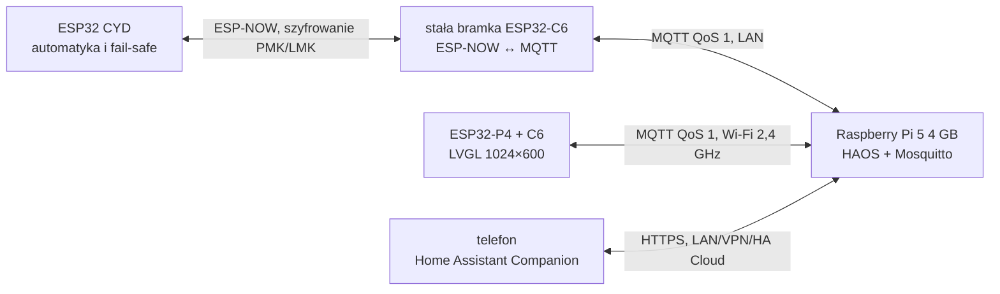

# Lokalny serwer AquaCYD na Raspberry Pi 5 4 GB

## Decyzja

Docelowym serwerem jest Raspberry Pi 5 4 GB z Home Assistant OS, połączony
przewodowo z routerem. Home Assistant OS jest zalecaną przez producenta metodą
instalacji na Raspberry Pi i zawiera Core, Supervisor oraz obsługę aplikacji.
Oficjalny instalator udostępnia osobny obraz `Raspberry Pi 5`.

Źródła:

- [instalacja Home Assistant OS na Raspberry Pi](https://www.home-assistant.io/installation/raspberrypi);
- [obsługiwane metody instalacji Home Assistant](https://www.home-assistant.io/installation);
- [specyfikacja Raspberry Pi 5](https://www.raspberrypi.com/products/raspberry-pi-5/);
- [wymagania zasilania Raspberry Pi](https://www.raspberrypi.com/documentation/computers/raspberry-pi.html#power-supply).

Pi 5 4 GB zapewnia zapas na historię, dodatkowe integracje, kopie zapasowe,
VPN i przyszłe kamery. Dla samego MQTT oraz AquaCYD jest mocniejszy niż
konieczne, ale jest dobrym wyborem, jeżeli sprzęt jest kupowany na kilka lat.

## Sprzęt

| Element | Zalecenie | Uzasadnienie |
|---|---|---|
| komputer | Raspberry Pi 5 4 GB | duży zapas dla HA i dodatków |
| zasilacz | oficjalny USB-C PD 27 W, 5 V / 5 A | pełny budżet zasilania Pi 5 i USB |
| chłodzenie | Active Cooler albo obudowa Pi 5 z wentylatorem | stabilna praca ciągła |
| nośnik startowy | karta microSD A2, minimum 32 GB | prosty start instalatora |
| nośnik danych | NVMe 256 GB przez zgodny HAT | trwałość historii i szybsze kopie |
| sieć | Gigabit Ethernet | mniejsze opóźnienia i brak zależności od Wi-Fi |
| podtrzymanie | mały UPS 5 V zgodny z Pi 5 | kontrolowane działanie przy zaniku sieci |

Nie zasilać Pi 5 z ładowarki telefonu ani z zasilacza panelu HMI. Serwer,
stacja ścienna HMI i sterownik CYD powinny mieć oddzielne, zabezpieczone tory
zasilania.

## Topologia



Raspberry Pi nie znajduje się w torze bezpieczeństwa. Odłączenie Pi, routera,
bramki lub panelu nie zatrzymuje harmonogramów, filtracji ani lokalnego
fail-safe CYD.

## Plan adresacji i Wi-Fi

1. Podłączyć Pi 5 przez Ethernet.
2. W routerze utworzyć rezerwację DHCP dla Raspberry Pi; nazwa mDNS pozostaje
   `homeassistant.local`.
3. Dla sieci urządzeń ustawić stały kanał 2,4 GHz: 1, 6 albo 11.
4. Wyłączyć automatyczną zmianę kanału 2,4 GHz, ponieważ ESP-NOW i Wi-Fi muszą
   pracować na tym samym kanale.
5. Nie udostępniać portów `1883` ani `8123` bezpośrednio do Internetu.
6. Zdalny dostęp realizować przez Home Assistant Cloud albo własny VPN.

## Instalacja Home Assistant OS

1. Zamontować chłodzenie, nośnik i podłączyć Ethernet.
2. W Raspberry Pi Imager wybrać:
   `Other specific-purpose OS → Home automation → Home Assistant → Raspberry Pi 5`.
3. Zapisać obraz na nośniku startowym i uruchomić Pi.
4. Otworzyć `http://homeassistant.local:8123` i wykonać onboarding.
5. Jeżeli używany jest NVMe, przenieść dysk danych przez
   `Settings → System → Storage → Move data disk`.
6. Zainstalować aplikacje:
   - Mosquitto broker;
   - Studio Code Server albo File editor;
   - Samba backup lub inną aplikację do kopii poza Raspberry Pi.
7. Włączyć integrację MQTT.

## Konta i uprawnienia MQTT

Utworzyć trzy osobne, nieadministracyjne konta:

| Konto | Urządzenie | Dostęp |
|---|---|---|
| `aquacyd_gateway` | stały ESP32-C6 | zapis stanu/ACK, odczyt poleceń |
| `aquacyd_hmi` | panel ESP32-P4 | odczyt stanu/ACK, zapis poleceń |
| `homeassistant` | Home Assistant | odczyt i zapis tematów AquaCYD |

Hasła muszą być unikalne i nie mogą trafić do Git. W przypadku zewnętrznego
Mosquitto minimalne prawa definiuje
`../../integrations/home_assistant/mosquitto/aquacyd.acl`. Aplikacja Mosquitto w Home
Assistant OS może uwierzytelniać użytkowników utworzonych w Home Assistant.

## Wgranie konfiguracji AquaCYD

Do `/config/configuration.yaml` dodać:

```yaml
homeassistant:
  packages: !include_dir_named packages

lovelace:
  dashboards:
    aquacyd:
      mode: yaml
      title: AquaCYD
      icon: mdi:fishbowl
      show_in_sidebar: true
      filename: dashboards/aquacyd.yaml
```

Następnie skopiować:

- `../../integrations/home_assistant/packages/aquacyd.yaml` do
  `/config/packages/aquacyd.yaml`;
- `../../integrations/home_assistant/dashboards/aquacyd.yaml` do
  `/config/dashboards/aquacyd.yaml`.

Po sprawdzeniu konfiguracji w `Developer tools → YAML` uruchomić Home Assistant
ponownie.

## Konfiguracja urządzeń

W bramce C6 i panelu P4 ustawić ten sam:

- broker: `mqtt://homeassistant.local:1883`;
- temat bazowy: `aquacyd/aquarium`;
- SSID sieci 2,4 GHz;
- właściwe, osobne konto MQTT.

Bramka C6 dodatkowo otrzymuje MAC sterownika CYD, PMK, LMK i konfigurację
kanału ESP-NOW. Sekrety CYD są provisionowane wyłącznie przez szyfrowane BLE,
zgodnie z `../../docs/ESP32_P4_C6_HOME_ASSISTANT_ARCHITECTURE.md`.

## Kolejność uruchomienia

1. Uruchomić Pi 5 i sprawdzić MQTT.
2. Uruchomić stałą bramkę C6; oczekiwany stan początkowy CYD to `offline`.
3. Uruchomić CYD; po pierwszej poprawnej telemetrii stan zmieni się na `online`.
4. Uruchomić panel P4; ekran startowy powinien przejść przez Wi-Fi, MQTT i CYD.
5. Sprawdzić pomiary, alarmy oraz stany wyjść.
6. Wykonać czasowe włączenie światła i potwierdzić aplikacyjny ACK.
7. Powtórzyć polecenie z tym samym `command_id`; CYD musi zwrócić duplikat bez
   ponownego wykonania.

## Testy odbiorcze

| Test | Oczekiwany wynik |
|---|---|
| odłączenie Ethernetu od Pi | CYD kontynuuje automatykę; HMI przechodzi w MQTT offline |
| wyłączenie HMI | telemetria C6 → HA działa nadal |
| wyłączenie bramki C6 | HA i HMI pokazują CYD offline |
| restart Pi | retained state wraca po połączeniu, polecenia nie są retained |
| aktywny wyciek | CYD wykonuje fail-safe, HMI i HA pokazują alarm |
| brak ACK | HMI kończy oczekiwanie błędem, bez fałszywego sukcesu |
| konflikt rewizji | HMI nie nadpisuje nowszej konfiguracji |

## Eksploatacja

- Raz w tygodniu wykonywać automatyczną kopię poza Raspberry Pi.
- Przed aktualizacją HAOS, Core i aplikacji tworzyć pełną kopię.
- Aktualizować osobno HAOS, Home Assistant Core oraz aplikacje.
- Monitorować temperaturę Pi, wolne miejsce i błędy zasilania.
- Raz na kwartał przeprowadzić test odłączenia Pi i bramki.
- Przechowywać eksport kluczy ESP-NOW i kont MQTT w zaszyfrowanym sejfie.
