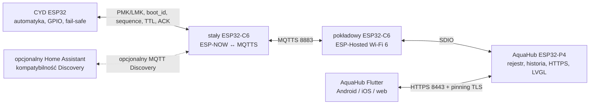
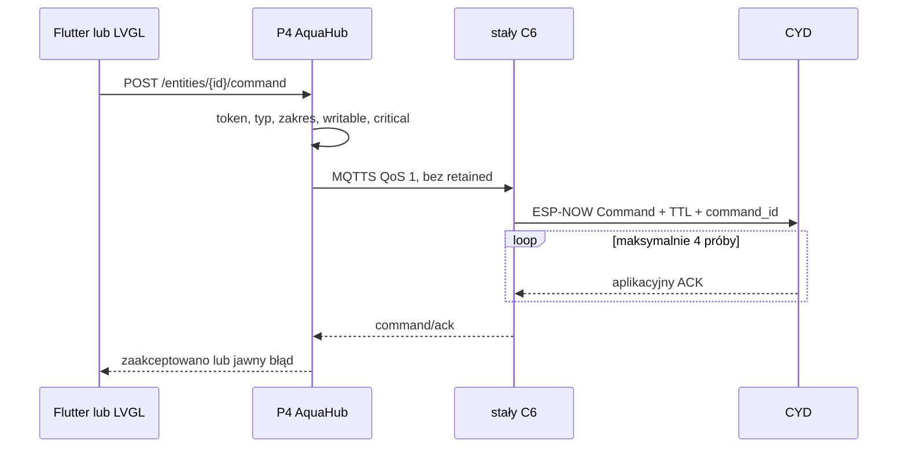

# AquaHub — architektura docelowa ESP32-P4 + ESP32-C6 + CYD

## Decyzja

AquaHub jest własnym, lekkim centrum urządzeń uruchamianym na panelu
ESP32-P4. Nie jest instalacją Home Assistant Core. Korzysta z uniwersalnego
modelu urządzenie–encja i zgodnego składniowo MQTT Discovery, dlatego może
obsługiwać kolejne czujniki bez dopisywania ich nazw do firmware’u panelu.
Oficjalny Home Assistant pozostaje opcjonalną integracją, a nie elementem
wymaganym do działania akwarium.

CYD zachowuje dotychczasowy kod, ekran, harmonogramy, interlocki i fizyczne
sterowanie. Utrata panelu, Wi-Fi, MQTT lub aplikacji nie zatrzymuje filtra,
grzałki ani zabezpieczeń.



W projekcie występują dwa różne C6. Układ na płytce Waveshare jest modemem P4,
a osobny C6 przy akwarium jest stabilną bramką radiową. Wypięcie panelu ze
stacji ściennej nie zmienia połączenia CYD ↔ stały C6.

## Granice odpowiedzialności

| Element | Odpowiedzialność | Zachowanie bez sieci |
|---|---|---|
| CYD | pomiary, harmonogramy, przekaźniki, alarmy i interlocki | pełna automatyka lokalna |
| stały C6 | szyfrowany ESP-NOW, walidacja, retry, ACK, translacja encji | CYD działa, telemetria jest buforowana tylko w CYD |
| P4 AquaHub | broker MQTTS, rejestr, krótka historia, HTTPS API, LVGL | lokalny ekran działa; brak nowych danych jest jawny |
| Flutter AquaHub | uniwersalny pulpit, historia, sterowanie, diagnostyka | pokazuje błąd połączenia, nie omija P4 |
| oficjalny HA | opcjonalna historia i integracje domu | nie jest wymagany |

Źródłem prawdy dla stanu fizycznego i konfiguracji bezpieczeństwa jest CYD.
AquaHub wysyła żądanie, a nie rozkaz bezwarunkowy. CYD może je odrzucić z
powodu konfliktu rewizji, trybu fail-safe, niedozwolonego celu lub upływu TTL.

## Uniwersalny kontrakt urządzeń

Urządzenie publikuje zatrzymany dokument Discovery w przestrzeni
`homeassistant/<component>/<device>/<entity>/config`. Nazwa prefiksu została
zachowana celowo dla zgodności ekosystemu, ale dokument zawiera też pola
AquaHub:

```json
{
  "aquahub_schema": 1,
  "unique_id": "aquacyd_filter",
  "name": "Filtr",
  "state_topic": "aquacyd/aquarium/state",
  "command_topic": "aquacyd/aquarium/command/entity/filter/set",
  "availability_topic": "aquacyd/aquarium/availability",
  "aquahub_value_key": "filter_on",
  "aquahub_critical": false,
  "device": {
    "identifiers": ["aquacyd_aquarium"],
    "name": "AquaCYD Aquarium",
    "model": "ESP32 CYD",
    "manufacturer": "AquaCYD",
    "sw_version": "1.0.0",
    "suggested_area": "Akwarium"
  }
}
```

Obsługiwane typy to `sensor`, `binary_sensor`, `switch`, `number`, `select`,
`button` i `light`. Rejestr P4 ma stałe limity 16 urządzeń, 128 encji i 32
reguł automatyzacji. Identyfikatory, tematy, zakresy, listy opcji i konflikty
tożsamości są walidowane przed rejestracją.

Stan AquaCYD zawiera `boot_id` sterownika oraz rosnące `sequence`. AquaHub
akceptuje nowy rozruch, ale odrzuca starszą lub powtórzoną wiadomość w obrębie
tego samego rozruchu. `gateway_boot_id` służy diagnostyce bramki i nie zastępuje
tożsamości źródłowego CYD.

## Ścieżka komendy



Uniwersalne przełączenie światła, filtra i napowietrzania tworzy na C6
unikatowy `command_id` i godzinny override. Grzałka, CO₂ i dolewka nie są
wystawiane jako zwykły `switch`. Krytyczne operacje nadal przechodzą przez
wersjonowany kontrakt CYD i jego interlocki.

## API aplikacji

P4 udostępnia wyłącznie HTTPS:

| Endpoint | Uwierzytelnienie | Znaczenie |
|---|---:|---|
| `GET /api/v1/info` | nie | produkt, wersja API, fingerprint, stan parowania |
| `POST /api/v1/pair` | kod fizyczny | wydanie tokenu Bearer |
| `GET /api/v1/system` | Bearer | stan P4 i rejestru |
| `GET /api/v1/devices` | Bearer | wszystkie urządzenia |
| `GET /api/v1/entities` | Bearer | stronicowana lista encji |
| `GET /api/v1/history` | Bearer | do 512 zmian w pierścieniu PSRAM |
| `POST /api/v1/entities/{id}/command` | Bearer | walidowana komenda |
| `GET /api/v1/events` | Bearer | WebSocket zmian rejestru |

Klucz P-256 i samopodpisany certyfikat powstają na P4 przy pierwszym
uruchomieniu i są przechowywane w NVS. Kod parowania ma sześć cyfr i ograniczony
czas życia. Aplikacja wymaga porównania SHA-256 z ekranem panelu, przypina
certyfikat i zapisuje token w systemowym secure storage.

## Provisioning MQTTS stałego C6

1. Uruchomić P4 i otworzyć ekran `System`.
2. Skopiować pełny fingerprint SHA-256.
3. Pobrać certyfikat i zweryfikować go poza pasmem:

   ```powershell
   $fingerprint = Read-Host "Wklej pełny fingerprint SHA-256 z panelu"
   .\tools\pin-aquahub-certificate.ps1 -ExpectedSha256 $fingerprint
   ```

4. W `firmware/esp32c6_gateway` uruchomić `idf.py menuconfig`.
5. Ustawić `mqtts://aquahub.local:8883`, identyczne konto brokera jak na P4 i
   włączyć `AQUACYD_MQTT_EMBED_HUB_CERTIFICATE`.
6. Ustawić SSID, MAC CYD oraz unikatowe PMK/LMK i zbudować C6.

Plik `main/aquahub.pem`, `sdkconfig` i sekrety są ignorowane przez Git.
Firmware C6 odmawia startu klienta MQTT, jeśli URI nie używa `mqtts://`,
certyfikat nie został osadzony albo hasło ma mniej niż 12 znaków.

## Pamięć i trwałość

Rejestr oraz historia powstają w 32 MB PSRAM P4. Kod nie wykonuje
nieograniczonej alokacji w pętli telemetrii. Historia v1 jest krótkim buforem
operacyjnym; po restarcie P4 zaczyna się od nowa. Docelowa wielomiesięczna
historia wymaga karty SD, zewnętrznej bazy lub opcjonalnego oficjalnego HA.

Tożsamość TLS, hash tokenu, jasność i ustawienia panelu są trwałe w NVS.
Retained Discovery odbudowuje rejestr urządzeń po ponownym połączeniu brokera.

## Aktualizacje

Obecne sloty partycji P4 i C6 są przygotowane do A/B OTA, a CYD zachowuje swój
istniejący podpisany format aktualizacji. Automatyczne pobieranie aktualizacji
przez AquaHub nie jest jeszcze włączone, ponieważ bez gotowej infrastruktury
podpisów i rollbacku stworzyłoby zdalny mechanizm wykonania kodu bez pełnego
łańcucha zaufania.

Kolejny etap musi wdrożyć równocześnie:

- manifest wersji podpisany kluczem wydaniowym offline;
- weryfikację SHA-256 obrazu i podpisu przed zapisem;
- osobne kanały stabilny/testowy;
- A/B OTA z potwierdzeniem zdrowia i automatycznym rollbackiem;
- zgodność wersji protokołu CYD–C6–P4;
- brak zdalnej aktualizacji CYD w czasie aktywnego alarmu;
- ręczne zatwierdzenie na panelu dla pierwszego wdrożenia.

Do tego czasu aktualizacje P4 i C6 wykonuje się świadomie przez USB. Jest to
ograniczenie bezpieczeństwa, a nie brakujący przycisk w UI.

## Stany awarii

| Awaria | Oczekiwany rezultat |
|---|---|
| P4 wyłączony lub wypięty | CYD działa; aplikacja i MQTTS są niedostępne |
| stały C6 wyłączony | CYD działa; AquaHub pokazuje urządzenie offline |
| router wyłączony | CYD działa lokalnie; połączenie wraca automatycznie |
| powtórzony stan MQTT | P4 odrzuca sekwencję |
| powtórzona komenda QoS 1 | CYD odpowiada wynikiem idempotentnym |
| brak ACK | C6 kończy po czterech próbach i publikuje timeout |
| aktywny wyciek | CYD wykonuje fail-safe; zdalne obejście jest niemożliwe |
| zmiana certyfikatu P4 | Flutter i C6 odmawiają połączenia do ponownego parowania |

## Sprzęt i panel odpinany

Referencją firmware’u jest Waveshare ESP32-P4-WIFI6-Touch-LCD-7B 1024×600.
Elecrow wymaga osobnego BSP i nie może otrzymać obrazu Waveshare. Stacja
ścienna powinna dostarczać 5 V przez złącze sprężynowe lub magnetyczne z
mechanicznym prowadzeniem. Tryb przenośny wymaga certyfikowanego modułu
ładowania, BMS, bezpiecznika i pomiaru temperatury ogniwa; ogniwa nie wolno
łączyć bezpośrednio z wejściem płytki.

## Kryterium wydania sprzętowego

Kod stanowi kompletny pionowy przepływ programowy, ale instalację można uznać za
produkcyjną dopiero po teście na fizycznych płytkach: minimum 72 h telemetrii,
odcięcia zasilania każdego elementu, zmiany kanału Wi-Fi, utraty ACK, alarmów
fail-safe, temperatury obudowy i pracy z panelu wypiętego ze stacji.
