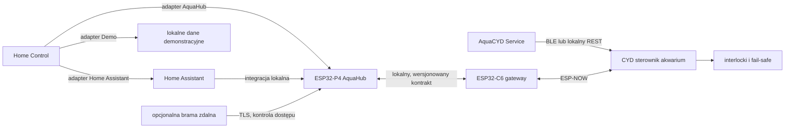

# Audyt stanu bazowego repozytorium

Data audytu: 2026-08-12, Europe/Warsaw  
Gałąź robocza: `codex/home-control-monorepo`  
Punkt bazowy: `a0663f20cc4e4f0429974c1a383d662007e73fee`

## Zakres i wynik

Repozytorium zawiera działający sterownik akwarium CYD, firmware koncentratora ESP32-P4, bramkę ESP32-C6, dwie aplikacje Flutter, bramę Node.js, integrację Home Assistant oraz webowy interfejs serwisowy. Wszystkie dostępne testy programowe i kompilacje bazowe zakończyły się powodzeniem; testy wymagające fizycznego sprzętu zostały jawnie pominięte, a nie zaliczone zastępczo.

Najważniejszy problem nie dotyczy działania produktu, lecz granic odpowiedzialności. Dokumentacja i nazwy aplikacji mieszają trzy osobne role: autonomiczny sterownik akwarium, uniwersalny panel domu oraz opcjonalny serwer Home Assistant. Migracja zachowuje działający kod i rozdziela te role bez przenoszenia bezpieczeństwa fizycznego poza CYD.

## Narzędzia bazowe

| Narzędzie | Wersja |
| --- | --- |
| Flutter | 3.41.5 |
| Dart | 3.11.3 |
| Node.js | 24.14 |
| npm | 11.9 |
| Python | 3.11.7 |
| PlatformIO Core | 6.1.19 |
| ESP-IDF | 5.4.4, lokalna przypięta instalacja |
| GitHub CLI | 2.96.0 |
| Git | 2.53 |

## Produkty i właściciele odpowiedzialności

| Obszar bazowy | Stan | Docelowa odpowiedzialność |
| --- | --- | --- |
| `src/`, `include/`, `platformio.ini` | firmware CYD | autonomiczne sterowanie fizycznym akwarium |
| `firmware/esp32p4_hmi` | ESP-IDF, działająca kompilacja | AquaHub: lokalny panel i agregator, bez logiki bezpieczeństwa CYD |
| `firmware/esp32c6_gateway` | ESP-IDF, działająca kompilacja | most radiowy ESP-NOW/Wi-Fi, bez deklarowania gotowego OTA |
| `mobile_app` | Flutter 6.0.0+20 | AquaCYD Service: serwis bezpośredni, BLE/REST, odzyskiwanie i kalibracja |
| `home_assistant_app` | Flutter 1.1.2+4 | Home Control: natywny, uniwersalny panel wielu źródeł |
| `gateway` | Node.js | opcjonalna brama zdalna, nigdy bezpośredni internet do CYD/P4 |
| `home_assistant` | integracja HA | opcjonalny adapter platformy Home Assistant |
| `web`, `sdcard` | PWA i pakiet urządzenia | interfejs serwisowy oraz zasoby urządzeń |

## Źródła prawdy

1. CYD jest jedynym źródłem prawdy dla GPIO, grzałki, filtra, napowietrzania, dolewki, CO2/dozowania, harmonogramów, alarmów, blokad, trybów awaryjnych i walidacji poleceń.
2. AquaHub przechowuje rejestr urządzeń, historię, automatyzacje wysokiego poziomu i sesje panelu. Polecenia dotyczące akwarium zawsze podlegają potwierdzeniu i walidacji przez CYD.
3. Home Control przechowuje wyłącznie stan interfejsu użytkownika, konfigurację źródeł i bezpieczne poświadczenia. Dane operacyjne pochodzą z aktywnego adaptera.
4. AquaCYD Service jest narzędziem serwisowym i nie staje się centralą domu.
5. Home Assistant pozostaje opcjonalnym źródłem danych, a nie nazwą ani warstwą domenową aplikacji.
6. Wersjonowane kontrakty urządzeń i formaty pakietów OTA są źródłem prawdy dla komunikacji. Interfejsy użytkownika nie interpretują prywatnych pól transportu.

## Zależności i przepływ danych

## Walidacja bazowa

| Zakres | Polecenie lub zestaw | Wynik |
| --- | --- | --- |
| Home app format | `dart format --output=none --set-exit-if-changed .` | 40 plików, bez zmian |
| Home app analiza | `flutter analyze` | bez problemów |
| Home app testy | `flutter test` | 37 zaliczonych |
| Home app web | `flutter build web --release` | powodzenie |
| Home app Android debug | `flutter build apk --debug` | powodzenie |
| Home app Android release | lokalna kompilacja | niewykonana: brak lokalnego `android/key.properties`; CI używa chronionych danych |
| Service app format | `dart format --output=none --set-exit-if-changed .` | 125 plików, bez zmian |
| Service app analiza | `flutter analyze` | bez problemów |
| Service app testy | `flutter test` | 240 zaliczonych |
| Service app Android debug/release | `flutter build apk` | oba warianty powodzenie; release 65,5 MB |
| API Node.js | `npm test` | 16 zaliczonych |
| Gateway Node.js | testy bramy | 17 zaliczonych |
| Web E2E | Playwright, wszystkie skonfigurowane projekty | 44 zaliczone |
| Domena C++ | PlatformIO `native` | 40 zaliczonych |
| ESP32-C6 | ESP-IDF 5.4.4 | powodzenie; aplikacja `0x28940`, 91% partycji wolne |
| ESP32-P4 | ESP-IDF 5.4.4 | powodzenie; aplikacja `0x10c1e0`, 79% partycji wolne |
| Narzędzia wydaniowe | walidator, trust anchor, pakiety firmware/web, SBOM, kontrola eFuse | powodzenie |
| HIL self-test | walidacja harnessu | 12 zaliczonych, 1 port szeregowy pominięty |
| Fizyczny HIL | testy z prawdziwym CYD/P4/C6 | 13 pominiętych z powodu braku urządzeń i bazowego URL |

Kompilacje produkcyjnych profili PlatformIO są rejestrowane ponownie po migracji. Bazowy profil `esp32dev` zakończył się powodzeniem: RAM 120 188/327 680 bajtów (36,7%), flash 1 890 085/1 966 080 bajtów (96,1%). Wysokie użycie flash jest ryzykiem wydaniowym i wymaga pilnowania budżetu w CI.

## Artefakty, duplikaty i pliki generowane

Repozytorium śledziło pięć APK o łącznym rozmiarze około 287 MB, dwa stare obrazy firmware oraz wygenerowany `compile_commands.json` o rozmiarze 15 580 439 bajtów. APK są dostępne w istniejących GitHub Releases (`mobile-v3.4.0`, `mobile-v4.0.0`, `mobile-v4.0.1`) z odpowiadającymi sumami SHA-256. Stare obrazy firmware pozostają odzyskiwalne z historii Git i mogą być odtworzone istniejącym procesem kompilacji.

Te binaria nie są źródłem prawdy i zostaną usunięte z bieżącego drzewa bez przepisywania historii. Metadane historycznych artefaktów i sumy kontrolne pozostaną w dokumentacji, a `.gitignore` będzie blokował ich ponowne przypadkowe dodanie. Wygenerowane katalogi `.pio`, Flutter `build`, `node_modules`, ESP-IDF `build` i lokalne `sdkconfig` są już ignorowane.

Lokalne `sdkconfig` ESP32-P4 i ESP32-C6 nie są źródłem prawdy. Dla P4 plik wygenerowany lokalnie zawierał nieaktualny adres MQTT i wyłączony rollback, podczas gdy śledzony `sdkconfig.defaults` poprawnie włącza rollback. Po czystej konfiguracji obowiązują wyłącznie śledzone defaults, Kconfig i tabele partycji.

## Dokumentacja sprzeczna lub historyczna

Dokumenty opisujące dawną aplikację jako „Home Assistant Flutter App” albo Raspberry Pi/Home Assistant jako obowiązkową centralę zachowują wartość historyczną, ale nie definiują bieżącego produktu. Ich status zostanie oznaczony, a dokumentami nadrzędnymi będą `PRODUCT_SPEC.md`, `MONOREPO_ARCHITECTURE.md`, `HOME_CONTROL_ARCHITECTURE.md` i `DEVICE_CONTRACT.md`.

## Stan roboczy użytkownika

Audyt wykrył następujące nieśledzone elementy i wyłączył je z migracji oraz commitów:

- `.codex-remote-attachments/`
- `MASTER_PROMPT_ODYSEUS_CODEX.md`
- `debug.log`
- `mobile_app/.clinerules`
- `mobile_app/.cursorrules`
- `web — kopia/`
- `web/index.html.bak`
- `web/settings_architecture_proposal.png`

## Ryzyka i granice potwierdzenia

- Nie wykonano fizycznych testów przekaźników, czujników, watchdogów, ESP-NOW ani rollbacku OTA.
- Nie potwierdzono produkcyjnych kluczy podpisu, procesu rotacji certyfikatów ani konfiguracji sklepów mobilnych.
- ESP32-C6 ma kompilowalny firmware mostu, lecz nie wolno opisywać jego OTA jako gotowego przed implementacją A/B i testem na sprzęcie.
- Bootloader P4 ma niewielki margines rozmiaru; aktualizacja ESP-IDF lub konfiguracji secure boot wymaga kontroli mapy pamięci.
- Każda operacja potencjalnie niebezpieczna musi pozostać potwierdzana w UI i autorytatywnie odrzucana przez CYD, niezależnie od stanu sieci i aplikacji.

