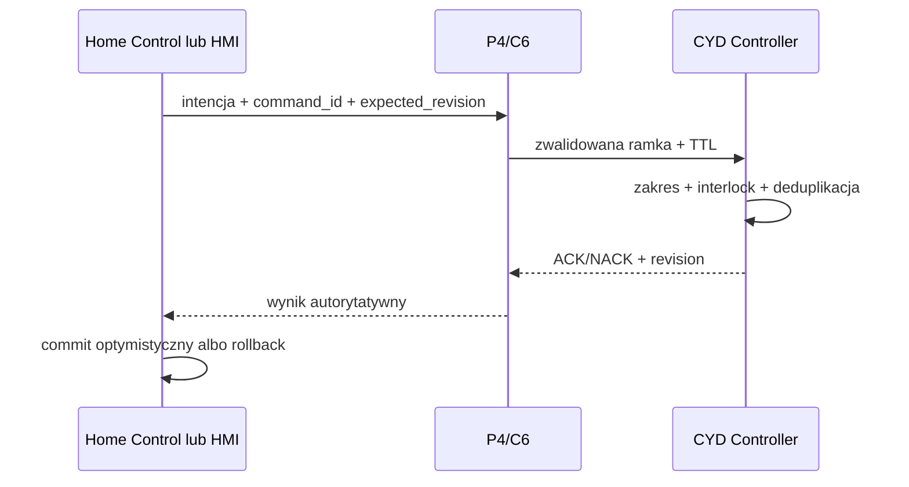

# Kontrakt urządzeń AquaCYD Link

## Własność i wersja

Kanoniczną definicją binarną jest
`firmware/shared/aquacyd_link/include/aquacyd_link_protocol.h`. Aktualna wersja
protokołu to `1`. Warstwa Dart w `packages/aquacyd_protocol` opisuje semantykę
akwarium i ryzyko poleceń; zgodność transportu jest pilnowana przez testy
kontraktowe C++ i modele źródeł Home Control.

## Koperta ramki

Ramka ma stały nagłówek 32 B, payload ograniczony do 214 B i CRC-32 4 B, dzięki
czemu mieści się w 250 B ESP-NOW. Zawiera wersję, typ, flagi, `source_id`,
`boot_id`, monotoniczny `sequence`, potwierdzaną sekwencję, czas wystawienia,
TTL i długość. UART używa tej samej ramki opakowanej w COBS.

Typy wiadomości: Hello, Telemetry, Alarm, Command, Acknowledgement,
Configuration, TimeSync i Heartbeat. Dekoder odrzuca zły magic, wersję,
tożsamość, typ, rozmiar, CRC, COBS i ramkę przeterminowaną przed przekazaniem do
logiki sterowania.

## Telemetria

`TelemetryPayload` ma jawne flagi ważności, temperaturę, pH, EC, LDR, stany
przekaźników, alarmy, uptime, heap, RSSI, rewizję konfiguracji, termostat oraz
cztery harmonogramy. Jednostki całkowitoliczbowe (`milli_c`, `ph_milli`,
`milli_us_cm`) eliminują zmiennoprzecinkową niejednoznaczność na łączu.

## Polecenie i ACK

Polecenie zawiera 64-bitowy `command_id`, akcję, cel, wartość, czas oraz
`expected_configuration_revision`. Akcje obejmują wyjścia, tryb, setpoint,
karmienie, alarm, snapshot, synchronizację czasu i harmonogram. ACK zawiera ten
sam `command_id`, status, kod powodu i nową rewizję.

Statusy ACK: Accepted, Duplicate, Rejected, Conflict, Invalid, Busy i Expired.
Nadawca ponawia wyłącznie ograniczoną liczbę razy z tym samym `command_id`.
Odbiorca przechowuje ograniczone okno deduplikacji, dlatego QoS 1 i ponowienie
ESP-NOW nie wykonują operacji drugi raz. Konflikt rewizji wymaga pobrania nowego
snapshotu; nie wolno automatycznie nadpisywać nowszej konfiguracji.

## Kompatybilność

- nieznane pole w warstwie JSON jest ignorowane;
- nieznany typ binarny lub większa wersja protokołu jest odrzucana;
- nowe pole binarne wymaga nowej wersji albo użycia jawnie zarezerwowanego pola;
- zmiana jednostki, kolejności lub znaczenia jest breaking change;
- starsza telemetria może być mapowana tylko przez jawny adapter zgodności;
- brak możliwości wykonania zwraca Unsupported/Invalid, nigdy pozorny sukces.

## Bezpieczny przebieg komendy

CYD pozostaje źródłem prawdy. Home Assistant, MQTT, P4 i aplikacje nie sterują
GPIO bezpośrednio.
