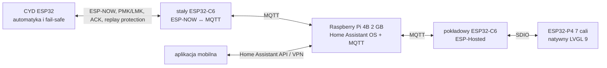

# Architektura AquaCYD: ESP32-P4, ESP32-C6 i Home Assistant

## Decyzja architektoniczna

CYD pozostaje autonomicznym sterownikiem czasu rzeczywistego i jedynym
elementem, który bezpośrednio steruje przekaźnikami oraz wykonuje zabezpieczenia.
Home Assistant na Raspberry Pi odpowiada za historię, automatyzacje wyższego
poziomu, powiadomienia i wspólny model danych. ESP32-P4 jest odpinanym panelem
LVGL, a nie hostem Home Assistant Core.

Docelowa instalacja zawiera **dwa układy ESP32-C6**:

1. C6 wbudowany w panel Waveshare/Elecrow działa przez ESP-Hosted jako modem
   Wi-Fi dla ESP32-P4.
2. Osobny, nieruchomy C6 jest bramką ESP-NOW ↔ MQTT. Dzięki temu wyłączenie,
   wypięcie lub rozładowanie panelu nie odcina CYD od Home Assistanta.



Nie należy kierować ESP-NOW bezpośrednio do C6 na odpinanym panelu. Standardowy
ESP-Hosted udostępnia P4 zdalne Wi-Fi, ale nie daje gotowego API ESP-NOW, a
panel stałby się pojedynczym punktem awarii całej telemetrii.

## Odpowiedzialności

| Element | Odpowiedzialność | Działa bez sieci |
|---|---|---:|
| CYD | pomiary, harmonogramy, histereza, przekaźniki, alarmy lokalne, fail-safe | tak |
| stały C6 | szyfrowany ESP-NOW, walidacja ramek, MQTT Discovery, ponowienia i dostępność | częściowo |
| Home Assistant | historia, dashboard, sceny, powiadomienia, aplikacja zdalna | nie |
| P4 + pokładowy C6 | duży interfejs dotykowy, podgląd, ograniczone polecenia MQTT | nie |
| aplikacja mobilna | codzienna obsługa przez HA; BLE pozostaje kanałem serwisowym CYD | częściowo |

Awaria Home Assistanta, MQTT, routera, bramki C6 albo HMI nie może wyłączyć
filtracji, grzania ani zabezpieczeń. Polecenie zdalne jest żądaniem, które CYD
może odrzucić z powodu trybu bezpieczeństwa, konfliktu lub przeterminowania.

## Sprzęt

Zalecany wariant budżetowy:

- obecny CYD;
- Waveshare ESP32-P4-WIFI6-Touch-LCD-7B, 1024×600, 32 MB PSRAM;
- osobny ESP32-C6-DevKitC-1 lub mały moduł C6 z poprawną anteną;
- Raspberry Pi 4B 2 GB z Home Assistant OS;
- markowy zasilacz USB-C 5 V / 3 A i SSD USB 3 zamiast karty microSD dla HA;
- Ethernet dla Raspberry Pi;
- stacja ścienna 5 V z magnetycznym lub sprężynowym złączem i mechanicznym
  zatrzaskiem panelu.

Raspberry Pi 5 ma sens dopiero przy kamerach, rozpoznawaniu obrazu, wielu
dodatkach lub ciężkiej bazie danych. Dla samego akwarium Pi 4B 2 GB jest
tańszy, chłodniejszy i wystarczający. Panel wymaga osobnego, certyfikowanego
układu ładowania i ochrony akumulatora; nie wolno podłączać ogniwa Li-Ion
bezpośrednio do wejścia 5 V płytki.

## Kontrakt komunikacyjny

Wspólny kod znajduje się w `lib/aquacyd_link`. Ramka:

- ma maksymalnie 250 bajtów;
- zawiera wersję, typ, źródło, identyfikator rozruchu, sekwencję, numer
  potwierdzanej sekwencji, czas wystawienia i TTL;
- kończy się CRC32;
- przenosi liczby w jednoznacznym little-endian, bez wysyłania surowych struktur;
- rozróżnia potwierdzenie radiowe od potwierdzenia wykonania polecenia;
- odrzuca powtórzenia oraz stare ramki po stronie CYD i C6.

`issued_at_ms` jest zegarem monotonicznym nadawcy. Odbiornik bez wcześniejszej
synchronizacji czasu nie porównuje go ze swoim `millis()`. TTL ogranicza czas
lokalnego kolejkowania i ponawiania u nadawcy, a ochronę odbiorcy zapewniają
sekwencja, `boot_id`, szyfrowanie ESP-NOW i brak retained dla poleceń MQTT.

ESP-NOW używa PMK oraz unikatowego LMK. CRC wykrywa błędy transmisji, ale to
LMK zapewnia poufność i uwierzytelnienie peer-to-peer. Klucze zapisane w NVS
są chronione przed fizycznym odczytem dopiero po wdrożeniu Flash Encryption.

MQTT używa tematów:

- `aquacyd/aquarium/state`;
- `aquacyd/aquarium/availability`;
- `aquacyd/aquarium/command/set`;
- `aquacyd/aquarium/command/ack`;
- `aquacyd/aquarium/hmi/availability`.

Każde polecenie MQTT musi zawierać niezerowy `command_id` zapisany jako dokładnie
16 cyfr szesnastkowych. Identyfikator tworzy klient (HMI albo Home Assistant) i
bramka przenosi go bez zmian do CYD. CYD przechowuje osiem ostatnich wyników
przez 10 minut bez alokacji dynamicznej. W tym oknie ponowienie QoS 1 lub
ponowne wysłanie tej samej wiadomości nie uruchamia drugi raz akcji
nieodwracalnej, np. karmnika. Przykład kompletnego polecenia:

```json
{
  "command_id": "18d4a6c30f924be1",
  "action": "set_output",
  "target": "light_primary",
  "value": 1,
  "duration_ms": 900000,
  "expected_revision": 305419896
}
```

`expected_revision=0` wyłącza optymistyczną kontrolę współbieżności. HMI używa
rewizji z ostatniej telemetrii, natomiast skrypty HA celowo wysyłają zero, bo
stan encji może być opóźniony. ACK zawiera status liczbowy i tekstowy, kod
przyczyny, aktualną rewizję oraz flagę `transport_timeout`.

Zdalnie dostępne wyjścia są celowo ograniczone do obu świateł, filtra i
napowietrzania. Grzałka, CO₂ oraz dolewka są tylko monitorowane; ich zaawansowane
reguły i zabezpieczenia pozostają lokalnie w CYD.

## Kanał radiowy

ESP-NOW i połączenie Wi-Fi STA muszą pracować na tym samym kanale. Router 2,4
GHz powinien mieć stały kanał 1, 6 albo 11. Stały C6 najpierw łączy się z Wi-Fi,
a potem uruchamia peer ESP-NOW na aktualnym kanale AP. CYD używa kanału swojej
sesji Wi-Fi albo zapisanego kanału awaryjnego, gdy nie jest połączony z AP.

Po zmianie kanału routera CYD i C6 mogą stracić łączność. Automatyka lokalna
działa nadal, a Home Assistant pokaże `offline`. Automatyczny wybór kanału w
routerze należy wyłączyć.

## Etapy wdrożenia

### 1. Home Assistant

1. Zainstalować Home Assistant OS na Raspberry Pi 4B 2 GB.
2. Podłączyć Pi przez Ethernet i przenieść bazę na SSD USB.
3. Dodać oficjalną integrację MQTT i lokalnego brokera Mosquitto.
4. Skopiować `home_assistant/packages/aquacyd.yaml` i
   `home_assistant/dashboards/aquacyd.yaml` zgodnie z
   `home_assistant/README.md`.
5. Utworzyć osobne konta MQTT dla bramki, HMI i HA. Dla samodzielnego Mosquitto
   użyć minimalnych uprawnień z `home_assistant/mosquitto/aquacyd.acl`.
6. Nie wystawiać MQTT ani CYD bezpośrednio do Internetu; użyć Home Assistant
   Cloud albo VPN.

### 2. Stała bramka C6

1. W `firmware/esp32c6_gateway` uruchomić `idf.py menuconfig`.
2. Ustawić SSID 2,4 GHz, MQTT, MAC CYD, PMK i LMK.
3. Zbudować i wgrać firmware ESP-IDF 5.4.4.
4. Sprawdzić w brokerze `availability=offline`; zmieni się na `online` dopiero
   po odebraniu poprawnej telemetrii CYD.

Klucze można wygenerować kryptograficznie:

```powershell
python -c "import secrets; print('PMK=' + secrets.token_hex(16)); print('LMK=' + secrets.token_hex(16))"
```

### 3. CYD z ESP-NOW

Zwykłe profile `esp32dev` i `esp32dev-st7789` zachowują dotychczasowe
zachowanie. Nowy transport jest opt-in:

```powershell
pio run -e esp32dev-espnow
pio run -e esp32dev-espnow -t upload
```

Po wgraniu trzeba zestawić szyfrowane BLE v2, uzyskać krótkotrwałą sesję
administratora i wykonać akcję `save_espnow_link`:

```json
{
  "v": 2,
  "op": "action",
  "name": "save_espnow_link",
  "commandId": "pair_c6_0001",
  "token": "00112233445566778899aabbccddeeff",
  "args": {
    "peerMac": "7C:DF:A1:12:34:56",
    "pmk": "5d41402abc4b2a76b9719d911017c592",
    "lmk": "d8578edf8458ce06fbc5bb76a58c5ca4",
    "channel": 6
  }
}
```

Wartości opisowe w przykładzie pokazują format i muszą zostać zastąpione
rzeczywistymi wartościami z urządzeń. Firmware odrzuca provisioning przez HTTP;
sekrety są przyjmowane tylko przez zaszyfrowane BLE z bondingiem, MITM i aktywną
sesją administratora. Po zapisie należy kontrolowanie zrestartować CYD.

### 4. Panel ESP32-P4

W `firmware/esp32p4_hmi` ustawić Wi-Fi i MQTT przez `idf.py menuconfig`, następnie
zbudować ESP-IDF 5.4.4. Panel subskrybuje retained state i availability. Przy
braku CYD blokuje przyciski, a przy braku HMI Home Assistant i CYD działają
dalej. Zakładki pokazują pomiary, alarmy, stany pięciu wyjść, pamięć, uptime,
rewizję konfiguracji i stan czujników bezpieczeństwa. Sterowanie jest blokowane
podczas oczekiwania na aplikacyjny ACK, a timeout i konflikt rewizji są jawnie
pokazywane. Jasność jest zapisywana w NVS.

Oba obrazy można zbudować:

```powershell
.\tools\build-p4-c6.ps1 -IdfPath C:\esp\v5.4.4-full\esp-idf
```

Wgranie wymaga jawnego wskazania jednej płytki i portu:

```powershell
.\tools\build-p4-c6.ps1 -Target c6 -IdfPath C:\esp\v5.4.4-full\esp-idf -Flash -Port COM7
.\tools\build-p4-c6.ps1 -Target p4 -IdfPath C:\esp\v5.4.4-full\esp-idf -Flash -Port COM8
```

Zaimplementowany BSP i pinout dotyczą
`Waveshare ESP32-P4-WIFI6-Touch-LCD-7B`. Wersja Elecrow wymaga osobnego BSP
zgodnego z konkretną rewizją płytki; nie należy wgrywać obrazu Waveshare do
Elecrow tylko dlatego, że oba urządzenia używają ESP32-P4 i ESP32-C6.

## Kryteria odbioru

1. Odłączenie Raspberry Pi nie zmienia lokalnych harmonogramów CYD.
2. Wyłączenie panelu nie przerywa telemetrii HA.
3. Wyłączenie bramki C6 ustawia encję jako `offline`.
4. Powtórzona ramka polecenia wykonuje akcję tylko raz.
5. Polecenie bez aplikacyjnego ACK kończy się błędem transportu.
6. Wyciek, przegrzanie i uszkodzenie czujnika nadal wymuszają fail-safe lokalnie.
7. Zmiana kanału jest wykrywana jako utrata łącza bez restartu automatyki.
8. Po restarcie nowy `boot_id` otwiera sekwencję, ale stara ramka nie działa.

## Kompromisy

Osobny C6 zwiększa koszt o niewielki moduł i zasilanie, ale usuwa zależność
telemetrii od odpinanego panelu. MQTT tworzy dodatkową warstwę, za to daje
Home Assistant Discovery, retained state i prostą integrację aplikacji.
Binarny protokół wymaga jawnych kodeków, lecz pozostaje mały, deterministyczny
i testowalny na komputerze.
