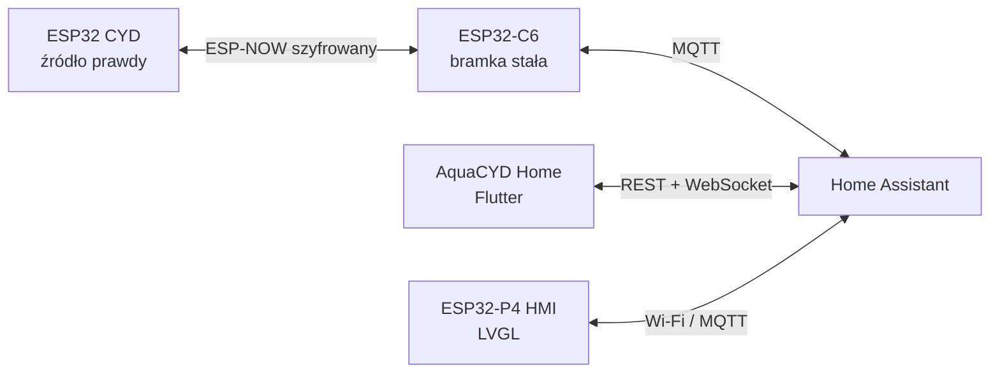

# AquaCYD Home — aplikacja Flutter dla Home Assistanta

## Cel

`home_assistant_app` jest lekkim panelem operatorskim dla codziennej obsługi
akwarium. Nie zastępuje Home Assistanta i nie przejmuje odpowiedzialności za
automatykę. Rozdzielenie ról jest celowe:

| Warstwa | Odpowiedzialność |
|---|---|
| CYD | czujniki, zegar, harmonogramy, przekaźniki, termostat, alarmy i fail-safe |
| ESP32-C6 | szyfrowany ESP-NOW, translacja telemetrii i poleceń, MQTT Discovery |
| Home Assistant | historia, skrypty komend, dashboard, automatyzacje i dostęp zdalny |
| AquaCYD Home | mobilny interfejs pomiarów, sterowania i konfiguracji |
| ESP32-P4 HMI | lokalny, odpinany panel LVGL działający również bez aplikacji |

Awaria telefonu, aplikacji, Home Assistanta lub Wi-Fi nie zatrzymuje lokalnej
automatyki CYD.

## Przepływ danych

Po uruchomieniu aplikacja:

1. odczytuje adres i token z bezpiecznego magazynu;
2. sprawdza `GET /api/config`;
3. pobiera `GET /api/states` i filtruje wyłącznie encje AquaCYD;
4. otwiera `/api/websocket`, uwierzytelnia token i subskrybuje `state_changed`;
5. po zerwaniu łącza ponawia połączenie z opóźnieniem 1, 2, 4, 8, 16 i 30 s;
6. nadal pozwala na ręczne odświeżenie REST, gdy WebSocket jest niedostępny.

Historia pochodzi z `/api/history/period`. Maksymalnie 180 uporządkowanych
punktów trafia do wykresu, co ogranicza obciążenie telefonu bez utraty czytelnego
kształtu trendu.

## Ekrany

| Ekran | Funkcja |
|---|---|
| Start | kondycja, cztery główne pomiary, stany pięciu wyjść, szybkie akcje |
| Sterowanie | czasowy override obu lamp, filtra i napowietrzania, karmienie |
| Historia | wykres temperatury, pH, EC lub światła dla 6 h, 24 h i 7 dni |
| Alarmy | stan wycieku, poziomu wody, konfiguracji i dekodowanie maski alarmów |
| Automatyka | cztery harmonogramy oraz nastawa termostatu zapisywane w CYD |
| System | serwer HA, transport, RSSI, pamięć, uptime, rewizja i brakujące encje |

Nawigacja używa sześciu ikon na telefonie i pełnego `NavigationRail` na ekranie
od 860 px. Karty przechodzą z jednej do czterech kolumn zależnie od szerokości.

## Kontrakt Home Assistant

Odczytywane są encje z prefiksem `aquacyd_aquarium`, w tym:

- `sensor.aquacyd_aquarium_temperature`, `ph`, `ec`, `ldr`;
- `sensor.aquacyd_aquarium_target_temperature` i
  `temperature_hysteresis`;
- `sensor.aquacyd_aquarium_alarms`, RSSI, uptime, heap i rewizja;
- pięć encji `binary_sensor` wyjść oraz cztery encje bezpieczeństwa;
- `sensor.aquacyd_aquarium_heater_mode`;
- dla każdego celu harmonogramu encje `schedule_mode`,
  `schedule_profile`, `schedule_start` i `schedule_end`.

Polecenia wywołują skrypty `script.aquacyd_*`. Czas ręcznego sterowania i
karmienia jest najpierw ustawiany przez `input_number.set_value`. Aplikacja nie
używa `POST /api/states` do sterowania, ponieważ taka operacja zmieniłaby
wyłącznie reprezentację stanu w HA, a nie fizyczne urządzenie.

## Obsługa błędów

- 401 i 403 są raportowane jako odrzucony lub unieważniony token;
- timeout, brak trasy i błąd DNS mają osobny komunikat sieciowy;
- błędny JSON nie jest interpretowany jako poprawny stan;
- nieznane encje i nienumeryczne próbki historii są pomijane;
- parametry harmonogramu, termostatu i czasu override są walidowane po stronie
  aplikacji, skryptu HA, protokołu C6 oraz ponownie w CYD;
- po nieudanym zapisie poświadczeń magazyn jest czyszczony, aby nie pozostawić
  częściowej konfiguracji.

## Model uwierzytelniania

Pierwsza wersja używa osobnego długoterminowego tokenu HA, co jest optymalne dla
prywatnej aplikacji instalowanej na własnych urządzeniach. Publiczna dystrybucja
w sklepie powinna przejść na OAuth Home Assistanta z rejestracją klienta i
krótkotrwałym access tokenem. Nie należy osadzać wspólnego tokenu w APK.

## Wdrożenie

1. Wgraj aktualną bramkę C6 i sprawdź encje MQTT Discovery.
2. Zainstaluj pakiet `home_assistant/packages/aquacyd.yaml`.
3. Zrestartuj HA i sprawdź wykonanie `script.aquacyd_request_snapshot`.
4. Utwórz osobnego użytkownika/token dla aplikacji.
5. Zbuduj Android APK albo hostuj web pod HTTPS.
6. Połącz aplikację i sprawdź zakładkę System; brakujące encje muszą wynosić zero.
7. Wykonaj kontrolowany test lampy, historii i każdej konfiguracji.
8. Test wycieku wykonuj wyłącznie na stanowisku lub z odłączonymi wykonawcami.

Wersja Android do publikacji musi być podpisana prywatnym kluczem przechowywanym
poza repozytorium. Wersja web musi mieć dokładny origin dodany do CORS Home
Assistanta i nie powinna być dostępna przez publiczne HTTP.
