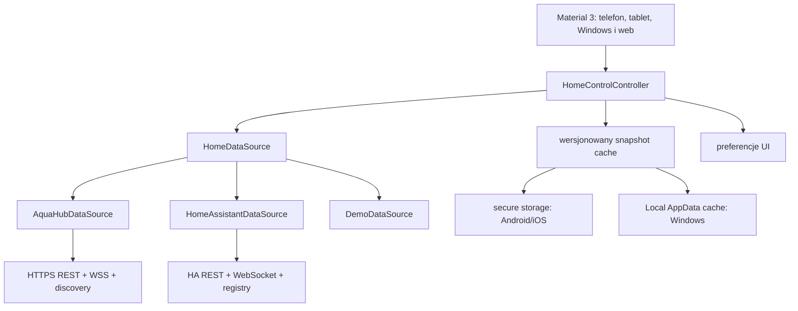

# Home Control — architektura aplikacji natywnej

## Rola produktu

Home Control jest niezależnym klientem Flutter całego domu. Nie renderuje
interfejsu Home Assistanta i nie używa WebView. Te same ekrany Material 3 działają
dla AquaHub, wielu instancji Home Assistant i pełnego Demo offline. Aplikacja
AquaCYD Service pozostaje odrębnym narzędziem technicznym sterownika akwarium.

## Warstwy



Widgety nie znają HTTP, WebSocket, BLE, MQTT ani formatu snapshotu. Kontroler
zarządza cyklem życia źródła, anulowaniem, pollingiem, serializacją komend i
stanem oczekiwania. Ostatnia wartość potwierdzona przez źródło pozostaje widoczna
do ACK lub kolejnego snapshotu, więc UI nigdy nie ogłasza ON przed backendem.
Adaptery mapują dane do `home_entities`; semantyka akwarium z
`aquacyd_protocol` podnosi ryzyko komendy, ale nie omija blokad CYD.

## Model domeny

Każda encja ma identyfikator `sourceId:localId`, dostępność, typ, stan, atrybuty,
czas zmiany, ograniczenia, możliwość zapisu i klasę ryzyka. Obsługiwane domeny to
światła, przełączniki, sensory, binary sensory, klimat, rolety, zamki, alarmy,
kamery, media, wentylatory, odkurzacze, pogoda, osoby, trackery, sceny, skrypty,
automatyzacje, przyciski, liczby, listy, tekst i aktualizacje. Nieznany typ jest
widoczny wraz z atrybutami, źródłem i czasem, ale bez zgadywania sterowania.

Snapshot zawiera źródło, pomieszczenia, urządzenia, encje, automatyzacje,
aktualizacje i stan synchronizacji. Cache ma wersję schematu, limit 512 KiB,
walidację per encja i zachowuje ostatni odczyt jako jawnie offline. Cache innej
instancji HA nie może zostać przywrócony do aktywnego profilu.

Na Windows odtwarzalny snapshot nie współdzieli kontenera DPAPI z tokenami.
Jest atomowo zapisywany jako zwykły tekst w nieroamingowym katalogu cache
`LocalAppData`; może zawierać nazwy, topologię i ostatnie stany, ale nigdy tokeny
ani dane parowania. Poświadczenia pozostają w systemowym secure storage. Taki
podział ogranicza częste przepisywanie kontenera sekretów kosztem braku
szyfrowania danych operacyjnych cache; cache można bezpiecznie usunąć i odbudować
ze źródła.

## Źródła danych

### AquaHub

Połączenie jest wykrywane lokalnie, a ręczny adres pozostaje ścieżką awaryjną.
REST pobiera pełny model, WSS sygnalizuje zmiany rejestru, a adapter wykonuje
ponowną synchronizację z debounce. Natywne połączenie wymusza HTTPS i sprawdza
SHA-256 fingerprint certyfikatu. Panel P4 nie jest wystawiany do Internetu.

### Home Assistant

REST pobiera konfigurację, stany, surową historię i wykonuje usługi. WebSocket
uwierzytelnia sesję, subskrybuje `state_changed`, utrzymuje ping/backoff, pobiera
oficjalne rejestry areas/devices/entities, katalog usług oraz zagregowane dane
Recorder `recorder/statistics_during_period`. Ponieważ interfejs statystyk może
zmieniać kształt i nie każda encja ma statystyki długoterminowe, parser toleruje
brakujące kolumny, a adapter wraca do historii REST zamiast blokować wykres.
Błąd rejestru analogicznie degraduje dane do stanów REST.

Profile wielu instancji zawierają nazwę, URL i oddzielny token w secure storage.
Można je dodawać, wybierać i usuwać. Token długoterminowy jest jawną ścieżką
zaawansowaną. Uruchomienie OAuth wymaga od właściciela publicznego Client ID i
kontrolowanego redirect URI; brak tych danych nie jest maskowany fikcyjnym
przyciskiem logowania.

### Demo

Demo nie wymaga sieci, konta ani sekretów. Udostępnia kilka pomieszczeń,
urządzenia, typy encji, akwarium, historię, alarm, aktualizacje i scenariusze
offline. Korzysta z tych samych typów domenowych, kontrolera komend, widoków i
semantyki ryzyka co źródła produkcyjne.

## UI/UX i dostępność

Model informacji obejmuje Pulpit, Pomieszczenia, Urządzenia i Automatyzacje jako
cztery główne cele. Aktualizacje oraz Ustawienia pozostają dostępne przez
`Więcej`, dzięki czemu telefon i panel 800×480 nie są przeładowane; pełny
`NavigationRail` pojawia się na większych ekranach. Dashboard pozwala zmieniać
kolejność, widoczność, rozmiar kart i ulubione. Pomieszczenia mają własne karty
kondycji oraz widoki szczegółowe, a sceny i skrypty są odróżnione od reguł
automatyzacji. Operacje konsekwencyjne lub krytyczne wymagają potwierdzenia, stan
oczekujący jest widoczny, a brak ACK pozostawia ostatni stan serwera.

Pierwszy ekran stosuje hierarchię „calm intelligence”: zagregowany stan domu,
centrum spraw wymagających reakcji, szybkie sterowanie, dostępne moduły domenowe,
pomieszczenia i rzeczywiste zmiany encji. Moduł akwarium jest ukrywany, gdy źródło
go nie udostępnia. Komunikat prawidłowego stanu oznacza brak aktywnych alarmów;
offline, stare lub niepełne dane mają osobne stany i nie są przedstawiane jako
bezpieczne. Liczniki OTA i urządzeń offline prowadzą bezpośrednio do właściwego
ekranu.

Interfejs obsługuje PL/EN, motyw systemowy/jasny/ciemny, powiększony tekst,
semantykę kontrolek, stany loading/empty/offline/stale/partial/error i inputy bez
polegania wyłącznie na kolorze. Aparaty i nieznane integracje są prezentowane
bez wykonywania niezweryfikowanych akcji.

Wspólny motyw definiuje jawną drabinę powierzchni, typografię, promienie i
semantyczne pary kolorów success/warning/info. Centralne tokeny obejmują także
spacing, rozmiary ikon, elevation, cienie, breakpointy i czasy animacji. Wspólne
komponenty dostarczają DeviceCard, RoomCard, SceneCard, StatusChip, SectionHeader,
Toggle, Slider, BottomSheet, Modal, Alert, Empty/Loading/ErrorState, MetricCard i
QuickAction. Testy kontrastu pilnują minimum WCAG dla tekstu, a karta encji
rozdziela akcję otwarcia szczegółów od przełącznika lub przycisku. Wszystkie
główne cele dotykowe mają minimum 48 dp. Macierz regresji obejmuje 320×568 i
800×480 przy skali tekstu 200%, oba motywy oraz goldeny obu formatów.

## Cykl życia i aktualizacje

Po wejściu aplikacja automatycznie sprawdza stabilny kanał `home-vX.Y.Z`.
Instalacja na Androidzie wymaga świadomej zgody użytkownika; APK jest sprawdzany
pod względem nazwy pakietu, wersji, rozmiaru, SHA-256 i certyfikatu podpisującego.
Ukrycie lub wstrzymanie aplikacji zatrzymuje aktywny polling, a wznowienie
wykonuje refresh i ponowne sprawdzenie OTA. Na Windows zdarzenie `inactive`
oznacza także widoczne okno bez fokusu, dlatego nie zatrzymuje pollingu.
Android instaluje zweryfikowany APK; Windows, iOS i web pokazują stan niewspierany
zamiast udawać instalację poza mechanizmem platformy. Windows aktualizuje się
przez niezależny Setup publikowany w tym samym release.

## Uruchomienie

```powershell
cd apps/home_control
flutter pub get
flutter run
```

Demo jest pierwszym bezpiecznym testem UI. Do HA należy utworzyć token o
minimalnych wymaganych uprawnieniach i używać HTTPS dla adresu zdalnego. HTTP
jest dopuszczane wyłącznie dla hostów lokalnych.
