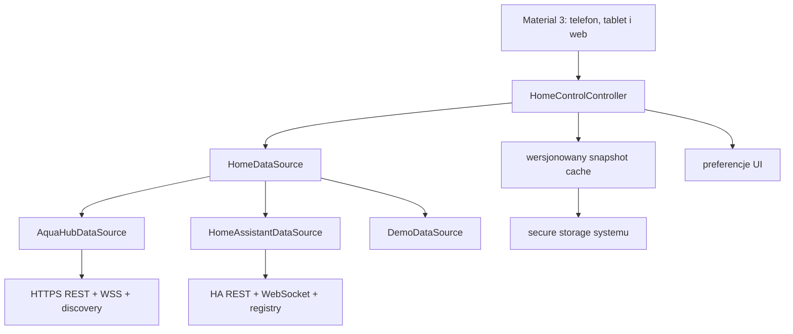

# Home Control — architektura aplikacji natywnej

## Rola produktu

Home Control jest niezależnym klientem Flutter całego domu. Nie renderuje
interfejsu Home Assistanta i nie używa WebView. Te same ekrany Material 3 działają
dla AquaHub, wielu instancji Home Assistant i pełnego Demo offline. Aplikacja
AquaCYD Service pozostaje odrębnym narzędziem technicznym sterownika akwarium.

## Warstwy



Widgety nie znają HTTP, WebSocket, BLE, MQTT ani formatu snapshotu. Kontroler
zarządza cyklem życia źródła, anulowaniem, pollingiem, optymistyczną zmianą i
rollbackiem. Adaptery mapują dane do `home_entities`; semantyka akwarium z
`aquacyd_protocol` podnosi ryzyko komendy, ale nie omija blokad CYD.

## Model domeny

Każda encja ma identyfikator `sourceId:localId`, dostępność, typ, stan, atrybuty,
czas zmiany, ograniczenia, możliwość zapisu i klasę ryzyka. Obsługiwane domeny to
światła, przełączniki, sensory, binary sensory, klimat, rolety, zamki, alarmy,
kamery, media, wentylatory, odkurzacze, pogoda, osoby, trackery, sceny, skrypty,
automatyzacje, przyciski, liczby, listy, tekst i aktualizacje. Nieznany typ jest
widoczny wraz z atrybutami, źródłem i czasem, ale bez zgadywania sterowania.

Snapshot zawiera źródło, pomieszczenia, urządzenia, encje, automatyzacje,
aktualizacje i stan synchronizacji. Cache ma wersję schematu, limit 512 KiB,
walidację per encja i zachowuje ostatni odczyt jako jawnie offline. Cache innej
instancji HA nie może zostać przywrócony do aktywnego profilu.

## Źródła danych

### AquaHub

Połączenie jest wykrywane lokalnie, a ręczny adres pozostaje ścieżką awaryjną.
REST pobiera pełny model, WSS sygnalizuje zmiany rejestru, a adapter wykonuje
ponowną synchronizację z debounce. Natywne połączenie wymusza HTTPS i sprawdza
SHA-256 fingerprint certyfikatu. Panel P4 nie jest wystawiany do Internetu.

### Home Assistant

REST pobiera konfigurację, stany, historię i wykonuje usługi. WebSocket
uwierzytelnia sesję, subskrybuje `state_changed`, utrzymuje ping/backoff i pobiera
oficjalne rejestry areas/devices/entities oraz katalog usług. Błąd rejestru
degraduje dane do stanów REST zamiast blokować aplikację.

Profile wielu instancji zawierają nazwę, URL i oddzielny token w secure storage.
Można je dodawać, wybierać i usuwać. Token długoterminowy jest jawną ścieżką
zaawansowaną. Uruchomienie OAuth wymaga od właściciela publicznego Client ID i
kontrolowanego redirect URI; brak tych danych nie jest maskowany fikcyjnym
przyciskiem logowania.

### Demo

Demo nie wymaga sieci, konta ani sekretów. Udostępnia kilka pomieszczeń,
urządzenia, typy encji, akwarium, historię, alarm, aktualizacje i scenariusze
offline. Korzysta z tych samych typów domenowych, kontrolera komend, widoków i
semantyki ryzyka co źródła produkcyjne.

## UI/UX i dostępność

Główna nawigacja ma Pulpit, Pomieszczenia, Urządzenia, Automatyzacje,
Aktualizacje i Ustawienia. Telefon używa dolnej belki, a szeroki ekran
`NavigationRail`. Dashboard pozwala zmieniać kolejność, widoczność, rozmiar kart
i ulubione. Operacje konsekwencyjne lub krytyczne wymagają potwierdzenia, stan
oczekujący jest widoczny, a brak ACK odtwarza stan serwera.

Interfejs obsługuje PL/EN, motyw systemowy/jasny/ciemny, powiększony tekst,
semantykę kontrolek, stany loading/empty/offline/stale/partial/error i inputy bez
polegania wyłącznie na kolorze. Aparaty i nieznane integracje są prezentowane
bez wykonywania niezweryfikowanych akcji.

## Cykl życia i aktualizacje

Po wejściu aplikacja automatycznie sprawdza stabilny kanał `home-vX.Y.Z`.
Instalacja na Androidzie wymaga świadomej zgody użytkownika; APK jest sprawdzany
pod względem nazwy pakietu, wersji, rozmiaru, SHA-256 i certyfikatu podpisującego.
Wstrzymanie aplikacji zatrzymuje aktywny polling, wznowienie wykonuje refresh i
ponowne sprawdzenie OTA. iOS i web pokazują stan niewspierany zamiast udawać
instalację poza mechanizmem platformy.

## Uruchomienie

```powershell
cd apps/home_control
flutter pub get
flutter run
```

Demo jest pierwszym bezpiecznym testem UI. Do HA należy utworzyć token o
minimalnych wymaganych uprawnieniach i używać HTTPS dla adresu zdalnego. HTTP
jest dopuszczane wyłącznie dla hostów lokalnych.
