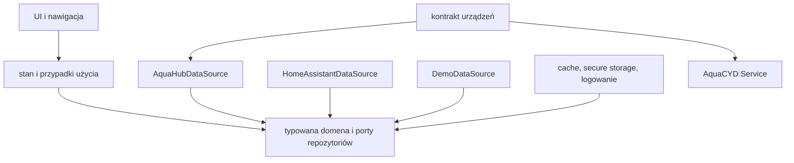

# Architektura monorepo

## Reguła zależności

Kod aplikacji zależy do środka: widoki korzystają z kontrolerów stanu, kontrolery z przypadków użycia i repozytoriów, a adaptery infrastruktury implementują kontrakty domenowe. Domena nie importuje Fluttera, HTTP, WebSocket, MQTT, BLE, bezpiecznego magazynu ani lokalnej bazy.

Zależności między pakietami są acykliczne. Pakiet współdzielony nie może importować żadnej aplikacji, a firmware nie zależy od kodu Flutter. Format komunikacji C++ i Dart może mieć równoważne modele, lecz zgodność jest pilnowana testami kontraktowymi oraz numerem wersji protokołu.

## Granice produktów

### `apps/home_control`

Produkt użytkownika końcowego do obsługi całego domu. Ma własne onboarding, źródła, dashboard, moduły pomieszczeń, automatyzacji, historii, diagnostyki i aktualizacji. Źródło jest wybierane przez dependency injection; żaden widget nie tworzy klienta sieciowego.

### `apps/aquacyd_service`

Produkt serwisowy do bezpośredniego połączenia ze sterownikiem. Zachowuje identyfikatory pakietów i istniejącą ścieżkę migracji danych. Może wykonać fizyczną kalibrację tylko podczas świadomej, lokalnej sesji serwisowej.

### `firmware`

`cyd_controller` jest warstwą wykonawczą i bezpieczeństwa. `esp32p4_hub` agreguje urządzenia i prezentuje LVGL. `esp32c6_gateway` izoluje radio urządzeń od sieci IP. `shared` zawiera wyłącznie biblioteki potrzebne przez więcej niż jeden firmware lub test hostowy.

### `services` i `integrations`

Usługa zdalna jest opcjonalnym punktem kontroli dostępu, limitowania i notyfikacji. Integracja Home Assistant mapuje wersjonowany kontrakt na encje HA; nie omija CYD i nie definiuje logiki fizycznej.

## Stan, cache i tożsamość

Każde źródło ma stabilne `sourceId`. Globalny identyfikator ma postać `sourceId:entityId`, dzięki czemu encje z dwóch instancji nie kolidują. Cache jest wersjonowany, rozdzielony według źródła i oznacza czas ostatniego potwierdzenia. Dane nieaktualne pozostają widoczne jako `stale`, lecz sterowanie może zostać zablokowane zależnie od ryzyka operacji.

Usunięcie źródła kasuje jego token, sesję, fingerprint i cache. Przełączenie źródła anuluje aktywne żądania, zamyka WebSocket i zatrzymuje polling. Ponowienia używają ograniczonego exponential backoff z jitterem, a wznowienie aplikacji wykonuje pełną synchronizację przed przyjęciem poleceń.

## Wersjonowanie

- Aplikacje mają niezależne `versionName` i `versionCode`.
- Kontrakt urządzeń ma osobną wersję schematu i zakres zgodności.
- Pakiety OTA zawierają produkt, płytkę, wersję, minimalną wersję bootloadera/kontraktu, rozmiar, SHA-256 i podpis.
- Migracje cache są monotoniczne i testowane na fixture poprzedniej wersji.
- Nieznane pola są ignorowane, a nieznane typy encji trafiają do bezpiecznej reprezentacji generycznej tylko do obsługiwanych działań.

## Własność testów

Testy jednostkowe mieszkają przy produkcie lub pakiecie. Testy kontraktowe danych współdzielonych należą do odpowiedniego pakietu. Playwright testuje panel web, a HIL testuje prawdziwy CYD/P4/C6. Raport końcowy zawsze rozróżnia testy symulowane od wykonanych na urządzeniu.
