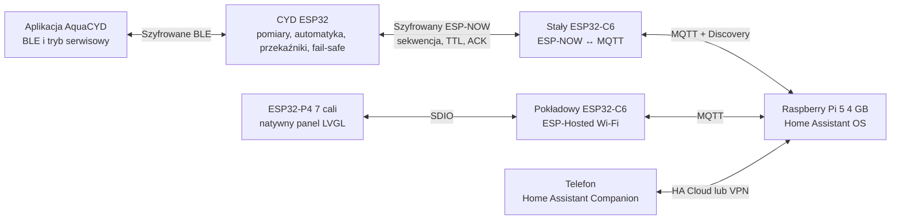

# Kierunek rozwoju AquaCYD

> Aktualizacja decyzji: rolę głównego centrum przejął własny AquaHub na
> ESP32-P4. Home Assistant Core i Raspberry Pi są opcjonalne. Obowiązującą
> architekturę opisuje [`AQUAHUB_ARCHITECTURE.md`](AQUAHUB_ARCHITECTURE.md), a
> poniższy tekst zachowuje wcześniejszy plan jako kontekst decyzji.

## Cel produktu

AquaCYD ma być odpornym na awarie sterownikiem akwarium z trzema poziomami
obsługi:

1. **CYD** wykonuje automatykę czasu rzeczywistego, steruje wyjściami i zawsze
   zachowuje lokalne zabezpieczenia.
2. **ESP32-P4 7"** jest odpinanym, ściennym panelem operatorskim do codziennej
   obsługi, diagnostyki oraz edycji ustawień.
3. **Home Assistant** przechowuje historię, realizuje automatyzacje wyższego
   poziomu, wysyła powiadomienia i zapewnia bezpieczny dostęp zdalny.

Home Assistant i panel HMI mogą zlecać działania, ale nie przejmują
odpowiedzialności za grzanie, ochronę przed wyciekiem, pracę filtra ani
zabezpieczenia dozowania. Awaria routera, Raspberry Pi, MQTT, bramki C6 lub HMI
nie może zatrzymać podstawowej automatyki akwarium.

## Architektura docelowa

Stała bramka C6 jest niezależna od C6 wbudowanego w płytkę P4. Dzięki temu
wypięcie albo rozładowanie panelu nie odcina telemetrii Home Assistanta.

## Stan obecny

| Obszar | Stan | Najważniejsze właściwości |
|---|---|---|
| CYD | działająca baza produkcyjna | harmonogramy, czujniki, przekaźniki, alarmy, BLE, WWW, OTA i fail-safe |
| Łącze CYD–C6 | zaimplementowane | PMK/LMK, ramki binarne, CRC32, ochrona replay, ACK i idempotencja |
| Bramka C6 | zaimplementowana | ESP-NOW ↔ MQTT, retry, availability i MQTT Discovery |
| HMI P4 | kompletny zakres programowy v2 | sześć ekranów, konfiguracja harmonogramów i termostatu, ACK, konflikt rewizji, tryb offline i jasność w NVS |
| Home Assistant | gotowy pakiet startowy | dashboard, skrypty, alarmy oraz ACL Mosquitto |
| CI | zaimplementowane | kompilacja CYD, C6 i P4 oraz publikacja artefaktów |
| Testy sprzętowe | do wykonania | potrzebne rzeczywiste CYD, dwa C6, panel P4, broker i docelowy router |

Aktualna implementacja HMI jest przeznaczona dla
`Waveshare ESP32-P4-WIFI6-Touch-LCD-7B`. Elecrow wymaga osobnego BSP, konfiguracji
panelu LCD, dotyku, pamięci i pinów. Obrazów firmware nie należy zamieniać między
tymi płytkami.

## Podział interfejsów użytkownika

### Ekran CYD

Ma pozostać prosty i niezależny:

- najważniejsze pomiary;
- stan alarmów;
- podstawowe ręczne sterowanie;
- komunikaty awaryjne;
- provisioning i diagnostyka serwisowa.

Nie należy rozbudowywać małego ekranu o wielopoziomowe formularze, historię i
dużą liczbę wykresów.

Interfejs CYD korzysta z kompaktowej odmiany systemu wizualnego P4: wspólnej
palety, płaskich kart, statusów w formie chipów oraz pięciu stałych pozycji
nawigacji. Sześć edytowalnych ramek 320×240 w `design/cyd-hmi` odwzorowuje
strony Start, Plan, Moduły, Wykres, System i wariant alarmowy.

### Panel ESP32-P4

Jest głównym lokalnym interfejsem:

- dashboard akwarium;
- stany wszystkich wyjść;
- alarmy wraz z wyjaśnieniem przyczyny;
- bezpieczne sterowanie czasowe;
- harmonogramy i profile oświetlenia;
- kalibracja oraz diagnostyka czujników;
- podgląd łączności CYD, C6, MQTT i Home Assistanta;
- ustawienia panelu, jasność, wygaszanie oraz informacje systemowe.

Operacje ryzykowne wymagają potwierdzenia, pokazania skutku i jawnego wyniku ACK.
Bezpośrednie przełączanie grzałki, CO₂ i dolewki pozostaje zablokowane. Dla
grzałki istnieje już osobny, ściśle walidowany kontrakt nastawy, histerezy i
trybu; wykonanie regulacji oraz wszystkie interlocki nadal należą do CYD.

### Home Assistant

Jest centrum danych i zdalnej obsługi:

- historia oraz wykresy;
- automatyzacje wyższego poziomu;
- sceny, powiadomienia i raporty;
- dashboard na telefon, tablet i komputer;
- integracja z innymi urządzeniami w domu.

Home Assistant nie powinien wykonywać szybkich pętli regulacji ani bezpośrednio
sterować GPIO. Nastawy krytyczne są zatwierdzane, ograniczane i przechowywane
przez CYD.

### Aplikacja mobilna AquaCYD

Docelowo aplikacja Home Assistant Companion staje się podstawowym interfejsem
zdalnym. Obecna aplikacja AquaCYD pozostaje kanałem:

- pierwszego uruchomienia;
- szyfrowanego provisioningu BLE;
- odzyskiwania po awarii Wi-Fi lub MQTT;
- lokalnej diagnostyki serwisowej;
- aktualizacji funkcji, których HA nie może bezpiecznie wykonać.

Nie należy utrzymywać dwóch niezależnych, pełnych paneli ustawień w Flutterze i
Home Assistant, ponieważ prowadzi to do rozbieżności zachowania i większego
kosztu testów.

## Własność danych i konfiguracji

| Dane | Źródło prawdy | Kopie i prezentacja |
|---|---|---|
| bieżące pomiary | CYD | C6, MQTT, HMI i HA |
| fizyczny stan wyjść | CYD | HMI i HA tylko prezentują |
| alarmy i interlocki | CYD | HA może powiadamiać, ale nie kasuje przyczyny |
| harmonogramy lokalne | CYD | HMI i HA są edytorami |
| historia | Home Assistant | opcjonalny eksport i kopia zapasowa |
| preferencje ekranu | HMI P4 | lokalne NVS |
| dane dostępowe | każde urządzenie osobno | nigdy w repozytorium ani retained MQTT |

Kontrakt konfiguracji jest logicznie oddzielony od prostych komend
sterujących, choć korzysta ze wspólnej, wersjonowanej ramki transportowej.
Każda transakcja konfiguracji zawiera:

- wersję schematu;
- unikatowy identyfikator operacji;
- oczekiwaną rewizję konfiguracji;
- jawnie wymienione zmieniane pola;
- walidację zakresów po stronie CYD;
- atomowy zapis albo pełne odrzucenie;
- ACK z nową rewizją i kodem wyniku;
- pełny snapshot po udanym zapisie.

## Plan rozwoju

### Etap 0 — baza architektury

Status: **ukończony programowo**.

- CYD pozostaje autonomiczny.
- Zaimplementowano protokół ESP-NOW i stałą bramkę C6.
- Zaimplementowano natywne HMI P4 oraz integrację Home Assistanta.
- Dodano testy, lockfile zależności i CI.

### Etap 1 — uruchomienie sprzętu i HIL

Status: **następny krok**.

1. Wybrać i kupić referencyjny panel Waveshare 7B.
2. Przygotować stałą bramkę C6 oraz Raspberry Pi 5 4 GB z NVMe.
3. Zmierzyć MAC, ustawić stały kanał Wi-Fi i wygenerować unikatowe PMK/LMK.
4. Sprawdzić ekran, dotyk, orientację, podświetlenie i ESP-Hosted.
5. Wykonać testy utraty Wi-Fi, MQTT, HA, C6 i zasilania panelu.
6. Zmierzyć zasięg, opóźnienia, retry i stabilność przez co najmniej 72 godziny.

Kryterium zakończenia: wszystkie scenariusze awarii zachowują automatykę CYD,
a telemetria i ACK wracają automatycznie po odtworzeniu łącza.

### Etap 2 — system projektowy HMI

Status: **ukończony programowo, oczekuje porównania na urządzeniu**.

1. Powstała mapa sześciu ekranów i hierarchia informacji.
2. Pakiet zawiera 13 edytowalnych ramek 1024×600 do importu w Figma.
3. Tokeny i animacje są wersjonowane w `design/hmi`.
4. Kod P4 rozdziela transport od kompletnego modułu `hmi_ui`.
5. Dostępne są stany startu, offline, stale, warning, error, confirmation,
   command pending i conflict.
6. Generator i podglądy SVG są sprawdzane programowo; końcowe porównanie
   pikselowe wymaga panelu Waveshare.

Kryterium zakończenia: każdy ekran ma zatwierdzoną makietę, komplet stanów oraz
odpowiadający jej komponent LVGL bez dynamicznej alokacji w pętli odświeżania.

### Etap 3 — bezpieczna edycja konfiguracji

Status: **rdzeń ukończony programowo, kalibracja pozostaje funkcją serwisową**.

1. Telemetria v2 przenosi harmonogramy, profile lamp i konfigurację termostatu,
   zachowując odczyt telemetrii v1.
2. CYD waliduje i zapisuje pojedynczy kompletny formularz atomowo, a HMI używa
   optymistycznej kontroli rewizji.
3. Panel ma formularze dla obu lamp, filtra, napowietrzania i termostatu.
4. Te same akcje MQTT mogą być wywoływane przez Home Assistanta bez powielania
   walidacji.
5. Kodeki, wartości brzegowe, replay i idempotencja są objęte testami natywnymi.

Kalibracja pH/EC celowo pozostaje w lokalnym trybie serwisowym CYD/BLE, ponieważ
wymaga fizycznego dostępu do sond i roztworów referencyjnych. Nie powinna być
udostępniana jako zwykła operacja zdalnego panelu.

Kryterium zakończenia: HMI i HA edytują tę samą konfigurację, a konflikt lub
nieprawidłowa wartość nigdy nie zmienia części danych.

### Etap 4 — obudowa i panel odpinany

1. Zaprojektować mocowanie ścienne oraz odciążenie przewodów.
2. Wybrać bezpieczne złącze dokujące 5 V.
3. Jeśli wymagany jest akumulator, użyć certyfikowanego układu ładowania, BMS,
   bezpiecznika i pomiaru temperatury ogniwa.
4. Dodać wykrywanie stacji, poziom baterii, wygaszanie i tryb oszczędny.
5. Sprawdzić temperaturę obudowy i pobór mocy przy pełnej jasności.

Kryterium zakończenia: panel można wypiąć bez restartu pozostałego systemu, a
układ zasilania przechodzi testy termiczne i zwarciowe.

### Etap 5 — utwardzenie produkcyjne

1. Dodać podpisane OTA dla C6 i P4 z rollbackiem.
2. Wdrożyć Secure Boot i Flash Encryption w kontrolowanym procesie produkcyjnym.
3. Dodać kopię zapasową konfiguracji HA i procedurę odtworzenia.
4. Wprowadzić wersjonowanie kompatybilności CYD, C6, HMI i HA.
5. Uruchomić długotrwałe HIL, testy odcięcia zasilania i testy aktualizacji.

Kryterium zakończenia: aktualizacja albo uszkodzenie jednego elementu nie
pozostawia akwarium bez lokalnych zabezpieczeń i pozwala na udokumentowany
rollback.

## Priorytety

1. Bezpieczeństwo lokalnej automatyki.
2. Stabilność i obserwowalność łącza.
3. Testy na docelowym sprzęcie.
4. Spójny system projektowy HMI.
5. Edycja konfiguracji z kontrolą rewizji.
6. Obudowa, bateria i ergonomia.
7. Dodatkowe integracje oraz funkcje kosmetyczne.

## Główne ryzyka

- Profil CYD z ESP-NOW zajmuje około 96,8% aktualnej partycji aplikacji.
  Kolejne duże funkcje wymagają optymalizacji albo zmiany układu partycji.
- ESP-NOW i Wi-Fi STA muszą pracować na zgodnym kanale 2,4 GHz.
- HMI jest obecnie zależne od konkretnego BSP Waveshare.
- Sloty OTA P4 i C6 są przygotowane, ale transport podpisanej aktualizacji nie
  jest jeszcze zaimplementowany.
- Makieta Figma nie gwarantuje wydajności na mikrokontrolerze; animacje,
  przezroczystości, obrazy i fonty muszą mieć budżet RAM, Flash i czasu renderu.

## Definicja wersji gotowej do instalacji

Projekt można uznać za gotowy do stałej instalacji dopiero wtedy, gdy:

- przejdzie pełny test HIL na docelowych płytkach;
- zostaną zweryfikowane wszystkie stany awarii;
- provisioning nie będzie zawierał wspólnych ani przykładowych sekretów;
- panel ścienny otrzyma bezpieczne zasilanie i obudowę;
- dashboard HMI i HA przejdzie test użyteczności;
- istnieje procedura kopii zapasowej, aktualizacji i rollbacku;
- zmierzone użycie pamięci pozostawia rezerwę na stos sieciowy i sytuacje
  szczytowe.

Szczegóły bieżącej architektury i wdrożenia znajdują się w
`docs/ESP32_P4_C6_HOME_ASSISTANT_ARCHITECTURE.md`, a proces projektowania HMI w
`docs/HMI_LVGL_FIGMA_WORKFLOW.md`.
