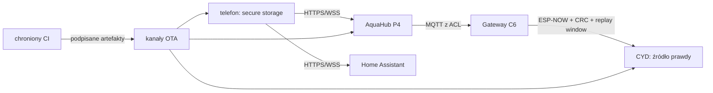

# Bezpieczeństwo systemu Home Control + AquaCYD

## Model zagrożeń

Chronione zasoby to żywe organizmy i urządzenia wykonawcze, konfiguracja domu,
poświadczenia sieciowe, tokeny Home Assistant/AquaHub/MQTT, klucze podpisu oraz
prywatna telemetria. Atakujący może znajdować się w niezaufanej sieci, przejąć
broker lub serwer aktualizacji, powtórzyć ramkę radiową, podmienić certyfikat,
ukraść telefon albo dostarczyć uszkodzony pakiet. Awaria zasilania, pamięci,
czujnika i łączności jest traktowana równie poważnie jak działanie złośliwe.

## Granice zaufania

CYD nigdy nie ufa samemu faktowi, że komenda przyszła z UI. Ponownie sprawdza
tożsamość, format, TTL, rewizję, deduplikację, zakres i interlock. Utrata P4, C6,
HA, MQTT, Wi-Fi lub telefonu nie może zatrzymać lokalnych harmonogramów i
fail-safe.

## Poświadczenia i prywatność

- Tokeny HA i fingerprinty AquaHub są w systemowym secure storage.
- Wiele profili HA ma oddzielne rekordy; usunięcie profilu usuwa token i cache.
- Logowanie redaguje Bearer, token, hasło, PIN, cookie, API key i dane Wi-Fi.
- Sekrety nie są wpisywane do repo, manifestów, screenshotów ani argumentów URL.
- MQTT ma osobne konta C6, P4 i HA, ACL minimalnych uprawnień i wyłączone anonymous.
- Port 1883, panel P4 i CYD nie są przekierowywane do Internetu. Zdalnie używa się
  VPN, Home Assistant Cloud lub opcjonalnej bramy z uwierzytelnieniem i limitami.
- Home Control nie sprzedaje telemetrii; cache jest lokalny i ograniczony.

Pliki `.env.example` mogą zawierać tylko nazwy zmiennych i bezpieczne wartości
lokalne. Prawdziwe sekrety są przekazywane przez chronione środowisko CI lub
menuconfig/NVS podczas provisioningu.

## Transport

AquaHub wymaga HTTPS i sprawdza SHA-256 fingerprint w natywnej aplikacji. Zmiana
odcisku jest błędem wymagającym świadomej rekonfiguracji. Home Assistant zdalny
wymaga HTTPS; HTTP jest akceptowany wyłącznie dla loopback, `.local` i prywatnych
adresów LAN. WebSocket używa odpowiadającego `wss`/`ws`, timeoutów, ping i
ograniczonego backoffu.

ESP-NOW ma wersjonowaną, ograniczoną ramkę, CRC-32, boot ID, sekwencję, TTL,
command ID i okno replay. CRC nie jest uwierzytelnieniem kryptograficznym;
instalacja seryjna wymaga chronionego klucza parowania ESP-NOW i procedury jego
rotacji. MQTT komendy nie są retained i używają QoS 1 z deduplikacją w CYD.

## OTA i łańcuch dostaw

Każdy produkt ma osobny target, kanał, wersję, kompatybilność i rollback.
Manifest zawiera identyfikator produktu/płytki, rozmiar, SHA-256, minimalną wersję
kontraktu/bootloadera, security version i podpis. Hash wykrywa uszkodzenie, ale
nie zastępuje podpisu. Klucze prywatne nie opuszczają chronionego CI/HSM.

CYD/P4 używają dwóch slotów i potwierdzają obraz dopiero po health checku. Secure
Boot v2, Flash Encryption i anti-rollback aktywuje się wyłącznie podczas
kontrolowanego provisioningu; pipeline nie przepala eFuse. Android APK jest
sprawdzany przed instalacją pod względem pakietu, wersji, SHA-256 i certyfikatu.
Nie wolno publikować produkcyjnego taga bez kluczy właściciela i pełnego HIL.

## Bramy wydania

Wymagane są testy, kompilacje release, skan sekretów, audyt zależności, SBOM,
walidacja manifestów, test rollbacku i fizyczny HIL. Symulator nie zastępuje
urządzenia. Brak klucza lub stanowiska jest jawnym `BLOCKED`, nie sukcesem.

Szczegóły firmware: [FIRMWARE_RUNTIME_SAFETY.md](FIRMWARE_RUNTIME_SAFETY.md),
[FIRMWARE_SIGNING_AND_PROVISIONING.md](FIRMWARE_SIGNING_AND_PROVISIONING.md) i
[PRODUCTION_SECURITY.md](PRODUCTION_SECURITY.md).
