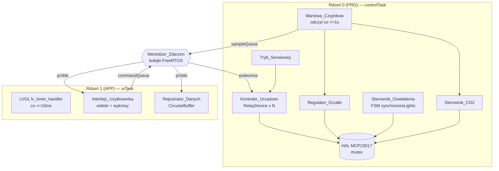
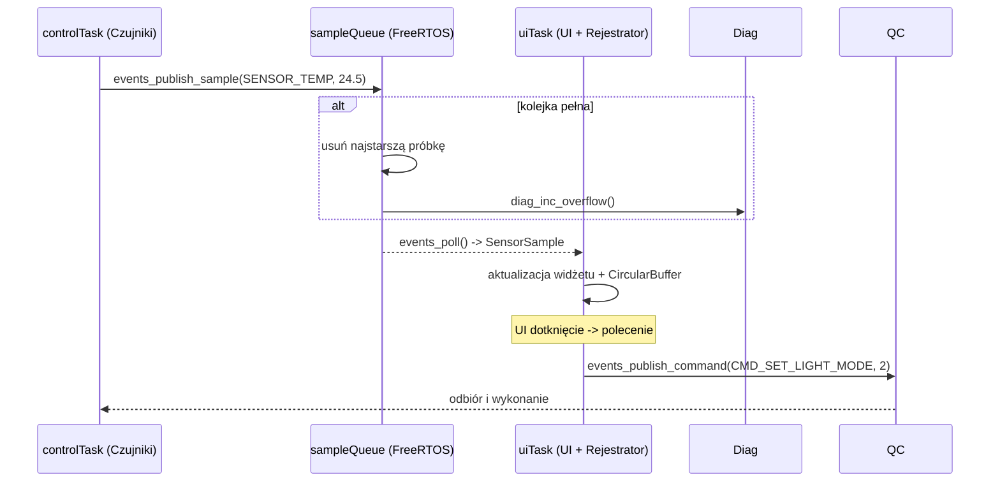
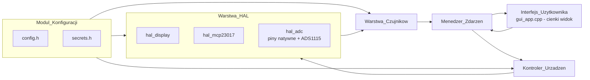
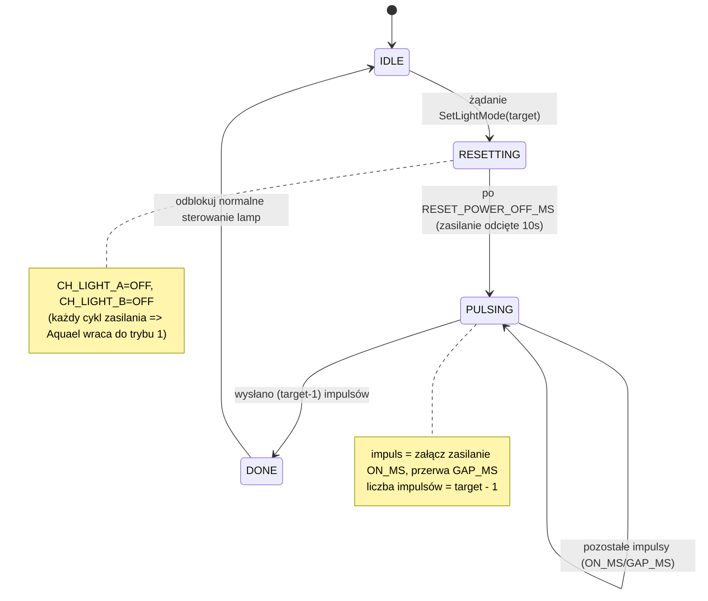
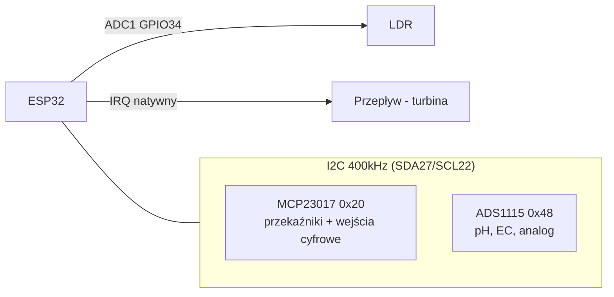
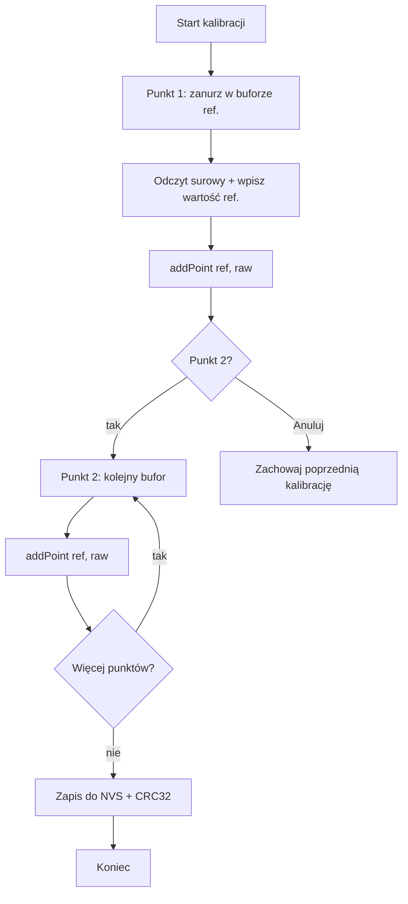

# Design Document

## Overview
<!-- Przegląd -->


Niniejszy dokument projektowy opisuje ewolucję istniejącego, działającego sterownika
akwariowego (ESP32 "Cheap Yellow Display", PlatformIO/Arduino, LVGL 8.3 + LovyanGFX)
w kierunku modułowej, dwurdzeniowej platformy sterowania opisanej w `requirements.md`.

**To NIE jest projekt od zera.** Punktem wyjścia jest sprawny kod demonstracyjny:

- `src/main.cpp` — jednowątkowa pętla `loop()`: taktowanie LVGL (`lv_tick_inc` +
  `lv_timer_handler`), symulacja zegara/temperatury/pH, odczyt LDR (GPIO34), odczyty ADC
  trybu deweloperskiego (GPIO35 temp, GPIO36 pH), `ArduinoOTA.handle()`.
- `src/gui_app.cpp` (~6200 linii) — całe UI **oraz** logika biznesowa: struktura
  `AquariumUiConfig` zapisywana w NVS z walidacją CRC32 (`magic`/`version`/`crc32` +
  `sanitize_config`), logika harmonogramów (`ScheduleMode` AUTO/AlwaysOn/AlwaysOff przez
  `is_within_window`/`schedule_active`) dla Światła/Światła roślinnego/Filtra/Napowietrzacza/
  Karmnika/Godzin ciszy, `HeaterMode` (próg + histereza), harmonogram karmnika (maska dni +
  do 2 godzin/dobę), 32-punktowe bufory cykliczne (`temp_history`, `heater_history`,
  `ph_history`, `ldr_history`, `heap_history`) rysowane jako wykresy LVGL, panele Wi-Fi i OTA,
  system dźwięku (głośnik LEDC GPIO26) z godzinami ciszy, auto-motyw LDR z histerezą,
  diagnostyka (heap, uptime, przyczyna resetu, licznik uruchomień, temp. CPU) oraz wstępna
  podstrona trybu serwisowego.
- `src/hal_display.cpp` + `include/hal_display.h` — urządzenie LovyanGFX (ST7789/ILI9341 +
  dotyk XPT2046), podwójne buforowanie DMA, sterowniki `lv_disp`/`indev`.

**Nowy kod (już utworzony, build przechodzi)** — projekt MUSI go zintegrować i odwoływać się
do niego, a nie definiować ponownie:

- `include/config.h` — `namespace HwConfig`: piny I2C (SDA 27, SCL 22, 400 kHz),
  `MCP23017_ADDR 0x20`, `enum McpChannel` (mapa 16 linii), `RELAY_ACTIVE_LOW=true`,
  `RELAY_SAFE_STATE_ON=false`, `namespace Lights` (`RESET_POWER_OFF_MS=10000`,
  `ADVANCE_PULSE_ON_MS=250`, `ADVANCE_PULSE_GAP_MS=350`, `MODE_COUNT=3`), stałe debounce.
- `include/secrets.h` + `include/secrets.example.h` — `namespace Secrets`: `WIFI_SSID`/
  `WIFI_PASSWORD`, `OTA_HOSTNAME`/`OTA_PASSWORD`, `DEFAULT_PIN "1234"` (`secrets.h` w gitignore).
- `include/hal_mcp23017.h` + `src/hal_mcp23017.cpp` — rejestrowy sterownik MCP23017 na `Wire`
  (bez zewnętrznej biblioteki), bezpieczny wątkowo (mutex FreeRTOS, timeout 50 ms), shadow
  OLATA/OLATB, konwersja logiczny↔fizyczny z `RELAY_ACTIVE_LOW`, bezpieczny stan na starcie.

### Cele projektowe

1. Rozdzielić renderowanie UI i logikę sterowania na dwa rdzenie ESP32 (Wymaganie 1).
2. Wprowadzić luźne powiązanie warstw przez zdarzenia/kolejki FreeRTOS (Wymaganie 2).
3. Wyodrębnić logikę biznesową z monolitu `gui_app.cpp` do osobnych modułów (Wymaganie 19.1),
   pozostawiając UI cienką warstwą widoku.
4. Dodać realne sterowanie sprzętem (przekaźniki MCP23017, synchronizacja świateł Aquael,
   regulacja grzałki, CO2, czujniki) przy zachowaniu wszystkich istniejących funkcji.

### Strategia ewolucji (przyrostowa, zachowująca funkcje)

Projekt jest **przyrostowy** i **zachowuje funkcje**. Każdy etap pozostawia kompilowalny,
działający firmware. Refaktoryzacja monolitu `gui_app.cpp` przebiega metodą "extract &
delegate": funkcja czysta jest najpierw wyodrębniana do nowego modułu (z identyczną logiką),
a `gui_app.cpp` zaczyna ją wywoływać zamiast posiadać kopię. Dzięki temu istniejące zachowanie
nie zmienia się, a kod staje się testowalny.

> **Zgoda użytkownika (Wymaganie 19.2).** Każde **usunięcie lub przeniesienie** istniejącej
> funkcjonalności z `gui_app.cpp` (np. przeniesienie `schedule_active`/`is_within_window`,
> logiki histerezy grzałki, harmonogramu karmnika czy buforów historii do nowych modułów)
> jest w tym dokumencie przedstawione jako **planowana** zmiana strukturalna i MUSI zostać
> potwierdzone przez użytkownika przed wykonaniem. Sekcja "Warstwa modułowa" zawiera jawną
> listę tego, co miałoby się przenieść.

### Mapowanie wymagań na istniejący kod

| Wymaganie | Istniejący kod (punkt zaczepienia) | Kierunek ewolucji |
|-----------|------------------------------------|-------------------|
| 1 Dwurdzeniowość | `loop()` w `main.cpp` | podział na zadania FreeRTOS przypięte do rdzeni |
| 2 Zdarzenia | bezpośrednie wywołania `gui_*` z `loop()` | kolejki FreeRTOS + `Menedzer_Zdarzen` |
| 3 Konfiguracja | `config.h`/`secrets.h` (gotowe) | pobieranie pinów/sekretów wyłącznie stąd |
| 4 Abstrakcja przekaźników | `schedule_active`, `ScheduleMode` | klasa `RelayDevice` + `hal_mcp_write_channel` |
| 5/17 Oświetlenie | `lightColorMode`, `cycle_light_color_mode` | `Sterownik_Oswietlenia` + `synchronizeLights()` |
| 6 Grzałka | blok histerezy w `gui_update_metrics`, `HeaterMode` | `Regulator_Grzalki` (funkcja czysta) |
| 7/8 Czujniki | LDR GPIO34, ADC dev-mode 35/36 | `Warstwa_Czujnikow` + ADS1115 + kalibracja |
| 11 Wykresy | `*_history[32]`, `add_history_point` | szablon `CircularBuffer<T,N>` |
| 12/18 OTA/diag | panele OTA, `diag_*`, `boot_count_val` | `Menedzer_OTA` + `Modul_Diagnostyki` |
| 13 PIN | brak | `Straznik_PIN` (`Secrets::DEFAULT_PIN`) |
| 14 Serwis | `subpage_service`, `service_*_cb` | `Tryb_Serwisowy` z auto-wygaśnięciem |
| 15 Degradacja | `showPhSensor` | uogólnione flagi enable + `hal_mcp_is_present()` |
| 16 Zgodność | `AquariumUiConfig` + CRC32 | bump `UI_CONFIG_VERSION` + migracja |

---

## Architecture
<!-- Architektura -->

### Model dwurdzeniowy FreeRTOS (Wymaganie 1)

Po refaktoryzacji `main.cpp` przestaje być pętlą roboczą, a staje się **bootstrapem**:
`setup()` inicjalizuje sprzęt i tworzy dwa zadania FreeRTOS, po czym `loop()` pozostaje pusty
(lub jedynie `vTaskDelay`). Praca dzieli się na:

- **Zadanie UI (`uiTask`)** przypięte do rdzenia APP (Core 1 — domyślny rdzeń Arduino):
  taktuje LVGL, obsługuje dotyk, odbiera zdarzenia pomiarowe i odrysowuje widżety.
- **Zadanie sterowania (`controlTask`)** przypięte do rdzenia PRO (Core 0): odczytuje
  `Warstwa_Czujnikow`, wykonuje `Kontroler_Urzadzen`/`Regulator_Grzalki`/`Sterownik_CO2`/
  `Sterownik_Oswietlenia`, steruje przekaźnikami przez `hal_mcp_*` i emituje zdarzenia próbek.



### Rola `setup()` / `loop()` po refaktoryzacji

```cpp
void setup() {
    Serial.begin(115200);
    // 1. HAL: ADC natywne, wyświetlacz, ekspander I2C
    sensors_init_native_adc();          // LDR GPIO34, ADC1 dev-mode
    lv_init();
    hal_display_init();
    hal_mcp_init();                     // I2C + bezpieczny stan przekaźników
    // 2. Kolejki i Menedzer_Zdarzen
    events_init();                      // tworzy sampleQueue + commandQueue
    // 3. UI (bez zmian w drzewie LVGL)
    gui_app_init();
    // 4. Zadania przypięte do rdzeni
    xTaskCreatePinnedToCore(uiTask,      "ui",      8192, nullptr, 2, nullptr, 1);
    xTaskCreatePinnedToCore(controlTask, "control", 8192, nullptr, 3, nullptr, 0);
}

void loop() { vTaskDelay(pdMS_TO_TICKS(1000)); } // pętla nieużywana
```

### Taktowanie LVGL i watchdog (Wymagania 1.4, 1.5)

Obecne `loop()` taktuje LVGL przez różnicę `millis()` i `lv_tick_inc(elapsed)` oraz kończy się
`delay(5)`. Po przeniesieniu do `uiTask`:

- `uiTask` wykonuje `lv_tick_inc`, `hal_display_loop_cb()` i `lv_timer_handler()` w pętli z
  `vTaskDelay(pdMS_TO_TICKS(5))` (kadencja ≤10 ms — Wymaganie 1.4).
- `vTaskDelay` oddaje czas planiście FreeRTOS, co zapobiega zadziałaniu watchdoga (Wymaganie
  1.5). Analogicznie `controlTask` używa `vTaskDelay` między cyklami próbkowania (≤1 s —
  Wymaganie 18.2).
- LVGL nie jest bezpieczny wątkowo: **wszystkie** operacje na obiektach `lv_obj_t*` wykonuje
  wyłącznie `uiTask`. `controlTask` nigdy nie dotyka API LVGL — przekazuje dane przez kolejkę.

---

## Components and Interfaces
<!-- Komponenty i interfejsy -->

Ta sekcja opisuje poszczególne komponenty Platformy i ich interfejsy: `Menedzer_Zdarzen`,
podział na warstwy modułowe, `Kontroler_Urzadzen` (w tym `Sterownik_Oswietlenia`,
`Regulator_Grzalki`, `Sterownik_CO2`, `Karmnik`, `Tryb_Serwisowy`), `Warstwa_Czujnikow` z
kalibracją, `Rejestrator_Danych`/`Modul_Wykresow`, `Menedzer_OTA`/`Modul_Diagnostyki`,
`Straznik_PIN` oraz mechanizm łagodnej degradacji. Każdy podrozdział podaje granice
odpowiedzialności i szkic API w C++.

### Menedzer_Zdarzen (Wymaganie 2)

#### Założenia

`Menedzer_Zdarzen` zapewnia jednokierunkowy, asynchroniczny przepływ między rdzeniami i znosi
obecne bezpośrednie wywołania `gui_update_metrics()`/`gui_app_update_ldr()` z `loop()`:

- **Zdarzenia próbek** (HAL/Czujniki → UI): publikowane przez `controlTask`, konsumowane przez
  `uiTask` (Wymagania 2.1, 2.2).
- **Zdarzenia poleceń** (UI → sterowanie): publikowane przez `uiTask` w odpowiedzi na dotyk,
  konsumowane przez `controlTask` (Wymaganie 2.3) — UI nie steruje `hal_mcp_*` bezpośrednio.

Transport: dwie kolejki `QueueHandle_t` FreeRTOS (Wymaganie 2.4). Dodatkowo lekki rejestr
subskrybentów (callbacki) umożliwia wielu odbiorcom reakcję na ten sam typ zdarzenia
(Wymaganie 2.6) — np. próbka temperatury trafia jednocześnie do widoku Home, do
`Rejestrator_Danych` i do panelu wykresów.

### Polityka przepełnienia (Wymaganie 2.5)

Kolejka próbek ma skończoną długość. Przy publikacji do pełnej kolejki próbek `Menedzer_Zdarzen`
**odrzuca najstarszą nieprzetworzoną próbkę pomiarową** (odczyt jednego elementu i ponowne
wstawienie nowego) oraz **inkrementuje licznik przepełnień w `Modul_Diagnostyki`**. Polecenia
(kolejka komend) nigdy nie są po cichu odrzucane — używają osobnej kolejki o większym
priorytecie logicznym i, w razie pełni, blokują na krótki timeout.



### Szkice typów zdarzeń (C++)

```cpp
// events.h — Menedzer_Zdarzen
enum class SensorId : uint8_t {
    Temp, Ph, Ec, WaterLevel, Flow, Leak, Co2, Ldr, Heap, CpuTemp
};

struct SensorSample {
    SensorId id;
    float    value;        // wielkość w jednostkach inżynierskich (lub stan 0/1 dla cyfrowych)
    uint32_t timestampMs;  // millis() w chwili pozyskania (Wymaganie 7.3)
    bool     valid;        // false => poza zakresem poprawności (Wymaganie 7.4)
};

enum class CommandType : uint8_t {
    SetLightMode,        // arg = tryb docelowy 1..3 -> wyzwala synchronizeLights()
    SetDeviceMode,       // arg = (deviceId, ScheduleMode)
    SetHeaterSetpoint,   // arg = (targetTemp, hysteresis)
    SetCo2Mode,
    TriggerFeed,
    EnterServiceMode,
    ExitServiceMode,
    StartCalibrationPoint,
    RequestOta
};

struct Command {
    CommandType type;
    int32_t     a;   // znaczenie zależne od type
    int32_t     b;
    float       f;
};

// API (cienkie opakowanie kolejek FreeRTOS)
bool events_init(void);
bool events_publish_sample(const SensorSample &s);   // polityka drop-oldest + overflow log
bool events_poll_sample(SensorSample &out);          // nieblokujące dla uiTask
bool events_publish_command(const Command &c);
bool events_poll_command(Command &out);              // controlTask
void events_subscribe(SensorId id, void(*cb)(const SensorSample&)); // multi-subscriber
```

---

### Warstwa modułowa (Wymaganie 19.1)

#### Granice modułów docelowych



Moduły jako odrębne pary `.h/.cpp`:

- **Warstwa_HAL**: `hal_display` (istnieje), `hal_mcp23017` (istnieje), `hal_adc` (nowy —
  natywne ADC1 + opcjonalny ADS1115).
- **Warstwa_Czujnikow**: `sensors.*` — wspólny interfejs `Sensor`, klasy konkretne, kalibracja.
- **Kontroler_Urzadzen**: `controller.*` — `RelayDevice`, `Sterownik_Oswietlenia`,
  `Regulator_Grzalki`, `Sterownik_CO2`, `Karmnik`, `Tryb_Serwisowy`.
- **Interfejs_Uzytkownika**: `gui_app.*` — pozostaje, ale odchudzony do warstwy widoku
  sterowanej zdarzeniami.
- **Modul_Konfiguracji**: `config.h` + `secrets.h` (gotowe).
- **Rejestrator_Danych**: `data_log.*` — szablon `CircularBuffer<T,N>`.
- **Menedzer_Zdarzen**: `events.*`.

#### Planowana migracja logiki z `gui_app.cpp` (wymaga zgody — Wymaganie 19.2)

Obecnie `gui_app.cpp` łączy widok z logiką. Docelowo UI ma być cienką warstwą sterowaną
zdarzeniami. **Poniższe przeniesienia są planowane i wymagają potwierdzenia użytkownika przed
wykonaniem.** Strategia: najpierw skopiować logikę do nowego modułu jako funkcje czyste,
przełączyć `gui_app.cpp` na ich wywoływanie (identyczne wyniki), a dopiero po weryfikacji
usunąć duplikat.

| Co przenieść z `gui_app.cpp` | Dokąd | Uwagi / ryzyko |
|------------------------------|-------|----------------|
| `is_within_window`, `schedule_active`, `to_minutes` | `controller.*` (funkcje czyste) | logika 1:1; UI nadal woła do etykiet |
| Blok histerezy grzałki z `gui_update_metrics` | `Regulator_Grzalki` | wydzielić jako `heater_decide()` |
| Harmonogram karmnika (maska dni + `feedHour*`) | `Karmnik` | zachować wyzwalanie i deduplikację 60 s |
| `add_history_point` + tablice `*_history[32]` | `Rejestrator_Danych` (`CircularBuffer`) | UI tylko czyta do wykresów |
| `cycle_light_color_mode`, `lightColorMode` | `Sterownik_Oswietlenia` | UI publikuje `SetLightMode` |
| Logika OTA z `btn_ota_handler` | `Menedzer_OTA` | UI tylko pokazuje postęp |

Do czasu zgody logika pozostaje w `gui_app.cpp`, a nowe moduły mogą ją wywoływać przez wąskie
API, bez usuwania oryginału (zgodność wsteczna — Wymaganie 16.1).

---

### Kontroler_Urzadzen — wspólna abstrakcja przekaźników (Wymaganie 4)

`RelayDevice` ujednolica sterowanie wszystkimi urządzeniami przekaźnikowymi (Filtr,
Napowietrzacz, a także bazowo CO2 i Grzałka). Reużywa istniejącej semantyki
`ScheduleMode`/`schedule_active`/`is_within_window` z `gui_app.cpp` (po migracji — funkcje czyste).

```cpp
enum class DeviceMode : uint8_t { Auto = 0, AlwaysOn = 1, AlwaysOff = 2 }; // == ScheduleMode

struct ScheduleWindow {
    uint8_t startHour, startMinute, endHour, endMinute;
};

class RelayDevice {
public:
    RelayDevice(HwConfig::McpChannel ch, DeviceMode mode, ScheduleWindow win)
        : channel_(ch), mode_(mode), win_(win) {}

    // Czysta decyzja — testowalna bez sprzętu (reużywa schedule_active)
    bool shouldBeOn(uint16_t nowMinutes) const {
        return schedule_active(static_cast<uint8_t>(mode_), nowMinutes,
                               win_.startHour, win_.startMinute,
                               win_.endHour, win_.endMinute);
    }

    // Efekt uboczny — wywoływane z controlTask
    void apply(uint16_t nowMinutes, bool serviceForcedOff) {
        const bool on = serviceForcedOff ? false : shouldBeOn(nowMinutes);
        hal_mcp_write_channel(channel_, on);   // Wymaganie 4.7 (pin z Modul_Konfiguracji)
    }
private:
    HwConfig::McpChannel channel_;
    DeviceMode mode_;
    ScheduleWindow win_;
};
```

Filtr i Napowietrzacz to dwie instancje `RelayDevice` na kanałach `CH_FILTER` i `CH_AERATOR`
(Wymaganie 4.6) — identyczna ścieżka kodu, różny kanał i okno harmonogramu.

---

### Sterownik_Oswietlenia + synchronizeLights() (Wymagania 5, 17)

#### Mapowanie trybów

Trzy tryby oświetlenia z Wymagania 5 odwzorowują istniejące pojęcie `lightColorMode`
(0/1/2 w `cfg`) na tryb sterownika Aquael (1/2/3) oraz kombinację lamp:

| Tryb UI (`lightColorMode`) | Tryb docelowy Aquael | Liczba impulsów | Znaczenie |
|----------------------------|----------------------|-----------------|-----------|
| 0 | 1 | 0 | jasny (bright) |
| 1 | 2 | 1 | jasny + rośliny |
| 2 | 3 | 2 | rośliny (plants) |

Obie świetlówki (`CH_LIGHT_A`, `CH_LIGHT_B`) zawsze kończą w tym samym trybie — sterowane
**jednocześnie** tymi samymi impulsami (Wymaganie 17.4).

#### Nieblokująca maszyna stanów

Reset trwa 10 s (`HwConfig::Lights::RESET_POWER_OFF_MS`). Użycie `delay(10000)` zagłodziłoby
`controlTask` i watchdog, dlatego operacja jest **nieblokującą maszyną stanów** taktowaną z
`controlTask` co cykl (czas mierzony przez `millis()`):



Stany:

- **IDLE** — brak operacji; lampy sterowane normalnie przez `RelayDevice`.
- **RESETTING** — oba kanały lamp wyłączone; po `RESET_POWER_OFF_MS` przejście do PULSING.
- **PULSING** — wysyłanie `target-1` impulsów do **obu** kanałów jednocześnie; każdy impuls to
  `ADVANCE_PULSE_ON_MS` w stanie ON i `ADVANCE_PULSE_GAP_MS` przerwy.
- **DONE** — operacja zakończona, odblokowanie sterowania (powrót do IDLE).

Podczas RESETTING/PULSING/DONE normalne sterowanie harmonogramem dla obu lamp jest
**zablokowane** (Wymaganie 17.5) — `RelayDevice` lamp nie wykonuje `apply()`, dopóki FSM nie
wróci do IDLE. Każda zmiana trybu z UI (`CommandType::SetLightMode`) przechodzi przez tę
operację (Wymaganie 17.6).

```cpp
class LightSyncFsm {
public:
    enum class State : uint8_t { Idle, Resetting, Pulsing, Done };
    void requestMode(uint8_t targetMode);          // 1..3
    void tick(uint32_t nowMs);                      // wołane z controlTask
    bool busy() const { return state_ != State::Idle; }

    // Funkcja CZYSTA — testowalna (Wymaganie 17.4)
    static uint8_t pulsesForMode(uint8_t targetMode) {
        return (targetMode >= 1 && targetMode <= HwConfig::Lights::MODE_COUNT)
                   ? static_cast<uint8_t>(targetMode - 1) : 0;
    }
private:
    State state_ = State::Idle;
    uint8_t targetMode_ = 1;
    uint8_t pulsesLeft_ = 0;
    uint32_t phaseStartMs_ = 0;
};
```

---

### Regulator_Grzalki (Wymaganie 6)

Wydzielenie istniejącej logiki histerezy z `gui_update_metrics` do funkcji czystej. Reużywa pól
`cfg.targetTemp`, `cfg.tempHysteresis`, `cfg.heaterMode` (`HeaterMode::Threshold`/`Off`).

```cpp
// Czysta decyzja — wejście: poprzedni stan + pomiar; wyjście: nowy stan grzałki
bool heater_decide(bool prevOn, HeaterMode mode, float temp,
                   float target, float hysteresis) {
    if (mode == HeaterMode::Off || !isfinite(temp)) return false; // fail-safe (6.5/6.6)
    if (temp < target - hysteresis) return true;   // załącz (6.3)
    if (temp >= target + hysteresis) return false;  // wyłącz (6.4)
    return prevOn;                                   // w paśmie -> bez zmiany (antyoscylacja)
}
```

> Uwaga: obecny kod używał progu wyłączenia `temp >= target` (zamiast `target + hysteresis`).
> Projekt ujednolica próg z Wymaganiem 6.4 (`target + hysteresis`) i utrzymuje stan w paśmie,
> co eliminuje oscylacje. `controlTask` przy `mode==Off` lub nieprawidłowym pomiarze wyłącza
> `CH_HEATER` i loguje błąd w `Modul_Diagnostyki` (Wymaganie 6.6).

---

### Warstwa_Czujnikow (Wymagania 7, 8)

#### Wspólny interfejs

```cpp
class Sensor {
public:
    virtual ~Sensor() = default;
    virtual SensorId id() const = 0;
    virtual bool enabled() const = 0;       // Wymaganie 15.3 (pomiń, gdy wyłączony)
    virtual SensorSample read() = 0;        // próbka z timestampem + flagą valid (7.2/7.3/7.4)
};
```

Każda próbka niesie znacznik czasu (`millis()`) i flagę `valid` ustawianą, gdy odczyt wykracza
poza zdefiniowany zakres poprawności (Wymaganie 7.4). Czujniki analogowe przeliczają surowy ADC
na jednostki inżynierskie (Wymaganie 7.2).

#### Ograniczenie sprzętowe ADC i propozycja ADS1115

**Problem.** ESP32 ma dwa bloki ADC: ADC1 (GPIO32–39) i ADC2. **ADC2 jest niedostępny przy
aktywnym Wi-Fi** (konflikt sterownika radiowego), a płytka CYD ma bardzo mało wolnych pinów.
W obecnym kodzie LDR korzysta z ADC1/GPIO34, a tryb deweloperski czyta GPIO35 (temp) i GPIO36
(pH) — przy czym **GPIO36 jest współdzielony z IRQ dotyku XPT2046** (patrz tabela pinów),
co jest realnym konfliktem.

**Decyzja projektowa.** Sondy analogowe (pH, EC, analogowy przepływ/jakość) odczytujemy przez
zewnętrzny przetwornik **ADS1115 na tej samej magistrali I2C** co MCP23017 (SDA 27 / SCL 22).
Zalety: 4 kanały 16-bit, brak konfliktu z Wi-Fi, brak zużycia pinów natywnych, uwalnia GPIO36.
Kompromis: dodatkowy komponent i ~kilka ms na odczyt I2C (akceptowalne przy próbkowaniu ≤1 s).
Natywne ADC1 (GPIO34 LDR; GPIO35 jako rezerwowy/temperatura dev-mode) pozostaje (Wymaganie
7.5, 16.4). MCP23017 **nie czyta analogowo** — obsługuje tylko wejścia/wyjścia cyfrowe.



#### Kalibracja wielopunktowa (Wymaganie 8)

`Sonda_pH` i `Sonda_EC` przechowują listę par (referencja, surowy odczyt). Konwersja używa
interpolacji liniowej między sąsiednimi punktami (segmentowo), z ekstrapolacją skrajnych
segmentów. Punkty zapisywane są w NVS z CRC32 (Wymaganie 8.5/8.6).

```cpp
struct CalPoint { float reference; float raw; };

class CalibrationCurve {
public:
    bool addPoint(float reference, float raw);   // sortuje rosnąco po raw; min. 2 punkty
    float toEngineering(float raw) const;          // interpolacja segmentowa/liniowa
    uint8_t pointCount() const;
    void clear();
private:
    static constexpr uint8_t MAX_POINTS = 5;
    CalPoint points_[MAX_POINTS];
    uint8_t  count_ = 0;
};
```

#### Czujniki "nie wiem" — konkretne implementacje początkowe

| Czujnik | Implementacja | Wejście | Uzasadnienie |
|---------|---------------|---------|--------------|
| Poziom wody | pływak (kontaktron) cyfrowy, debounce | `CH_WATER_LEVEL` (MCP PORTB, `WATER_LEVEL_ACTIVE_LOW`) | wolnozmienny, idealny dla MCP |
| Wyciek | mata przewodząca, cyfrowa, debounce | `CH_LEAK` (MCP PORTB, `LEAK_ACTIVE_LOW`) | zdarzenie binarne |
| Przepływ | licznik impulsów turbiny na **natywnym** pinie ESP32 z przerwaniem | natywny GPIO (ISR) | MCP nie obsługuje szybkich przerwań/zliczania impulsów |
| CO2 | elektrozawór sterowany przekaźnikiem | `CH_CO2` (MCP PORTA) | wyjście binarne |

Przepływ MUSI używać przerwania natywnego ESP32 (nie MCP23017), ponieważ ekspander I2C nie
nadaje się do zliczania impulsów o wysokiej częstotliwości — to potwierdza komentarz w
`config.h` przy `CH_FLOW_PULSE` (rezerwa tylko dla wariantu ON/OFF).

---

### Kreator_Kalibracji (Wymaganie 8)

Podstrona UI prowadząca przez co najmniej 2 punkty referencyjne:



Anulowanie przed ukończeniem zachowuje poprzednie punkty bez zmian (Wymaganie 8.7) — Kreator
pracuje na kopii roboczej i zapisuje dopiero przy zatwierdzeniu (Wymaganie 8.4/8.5).
Uruchomienie kalibracji jest akcją krytyczną (`Straznik_PIN`, Wymaganie 13.5).

---

### Sterownik_CO2 (Wymaganie 9)

Dwa tryby: harmonogramowy (jak `RelayDevice` na `CH_CO2`) lub powiązany z pH.

```cpp
bool co2_decide(bool serviceActive, bool phLinked, bool phValid,
                float ph, float phThreshold, uint16_t nowMin, const ScheduleWindow &w) {
    if (serviceActive) return false;                 // 9.4 zamknij w trybie serwisowym
    if (phLinked) {
        if (!phValid) return false;                  // 9.5 błąd pH -> zamknij + log
        return ph > phThreshold;                     // 9.2 pH wysokie -> otwórz; 9.3 niskie -> zamknij
    }
    return is_within_window(nowMin, w.startHour, w.startMinute, w.endHour, w.endMinute);
}
```

Przy nieprawidłowym pH w trybie powiązanym `controlTask` zamyka `CH_CO2` i loguje błąd w
`Modul_Diagnostyki` (Wymaganie 9.5).

---

### Karmnik (Wymaganie 10) — szkielet

Reużywa istniejącego harmonogramu karmnika z `gui_app.cpp` (`feedEnabled`, `feedDays`,
`feedCount`, `feedHour1/Minute1`, `feedHour2/Minute2`) i deduplikacji 60 s. Wyzwolenie:
impuls na `CH_FEEDER_DRIVE` (PORTA); odczyt pozycji/sprzężenia: `CH_FEEDER_POS` (PORTB).
Gdy `feedEnabled == false`, brak sygnału wyzwalającego (Wymaganie 10.5). Piny pochodzą wyłącznie
z `Modul_Konfiguracji` (Wymaganie 10.1/10.2).

---

### Rejestrator_Danych + Modul_Wykresow (Wymaganie 11)

Obecnie istnieje 5 równoległych tablic 32-punktowych z ręcznym przesuwaniem w
`add_history_point`. Projekt unifikuje je w **jeden szablon**:

```cpp
template <typename T, uint8_t N>
class CircularBuffer {
public:
    void push(const T &v) {
        buf_[head_] = v;
        head_ = (head_ + 1) % N;
        if (count_ < N) ++count_;          // nigdy nie przekracza N
    }
    uint8_t size() const { return count_; }
    static constexpr uint8_t capacity() { return N; }
    // Indeks 0 = najstarsza z N ostatnich próbek (FIFO)
    const T &at(uint8_t i) const { return buf_[(head_ + N - count_ + i) % N]; }
private:
    T buf_[N];
    uint8_t head_ = 0;
    uint8_t count_ = 0;
};
```

Instancje: `CircularBuffer<float,N>` dla temp/pH, `CircularBuffer<int,N>` dla LDR,
`CircularBuffer<uint32_t,N>` dla heap, `CircularBuffer<bool,N>` dla stanu grzałki.
`Modul_Wykresow` (LVGL) odczytuje `at(i)` i wpisuje punkty do serii wykresu (jak obecny
`update_charts_data`).

**Historia 24 h (Wymaganie 11.3).** Pojemność N i interwał próbkowania wiąże zależność
`N × interwał ≥ 24 h`. Aby przy rozsądnym N pokryć 24 h, do wykresów historycznych stosujemy
**decymację**: czujniki próbkują ≤1 s (Wymaganie 18.2), ale do bufora 24 h trafia uśredniona/
decymowana próbka co `24h / N`. Dla N=32 daje to próbkę co 45 min; jeśli wymagana jest większa
rozdzielczość, N zwiększamy (np. 96 → co 15 min). Bufor "na żywo" (krótki) i bufor 24 h mogą
współistnieć jako dwie instancje tego samego szablonu.

---

### Menedzer_OTA + Modul_Diagnostyki (Wymagania 12, 18)

- **OTA**: zachowujemy istniejący `ArduinoOTA` (handler w `btn_ota_handler`, pętla
  `ArduinoOTA.handle()` przeniesiona do dedykowanego fragmentu `uiTask`/zadania sieciowego).
  Hostname/hasło z `Secrets::OTA_HOSTNAME`/`OTA_PASSWORD`. Postęp prezentowany w UI (istniejące
  `onProgress`/`onStart`/`onEnd`/`onError`, Wymaganie 12.2). Niepowodzenie zachowuje firmware
  (natura ArduinoOTA) i loguje błąd w diagnostyce (Wymaganie 12.3).
- **Bezpieczeństwo przed restartem**: przed restartem po OTA `Menedzer_OTA` wywołuje
  `hal_mcp_all_relays_safe()`, aby przekaźniki przeszły w bezpieczny stan.
- **Diagnostyka**: istniejące `diag_*` (heap, uptime, przyczyna resetu, `boot_count_val`, temp.
  CPU). Wartości odświeżane ≤2 s (Wymaganie 12.5) przez timer LVGL w `uiTask`. Dodajemy licznik
  przepełnień kolejki zdarzeń (Wymaganie 2.5) i wolny heap do detekcji wycieków (Wymaganie 18.3).

---

### Straznik_PIN (Wymaganie 13)

Bramka PIN przed akcjami krytycznymi. PIN domyślny: `Secrets::DEFAULT_PIN` ("1234").

- Akcje chronione (Wymaganie 13.5): edycja harmonogramów urządzeń, zmiana nastaw grzałki,
  uruchomienie kalibracji sond, aktywacja OTA, zmiana PIN-u.
- Podgląd odczytów, wykresów i diagnostyki — **bez** PIN-u (Wymaganie 13.6).
- Po wybudzeniu ekranu lub starcie wymagana ponowna autoryzacja przy pierwszej akcji krytycznej
  (Wymaganie 13.4) — flaga `s_authenticated` zerowana na starcie i przy wybudzeniu.
- Błędny PIN odrzuca akcję i nie zmienia konfiguracji (Wymaganie 13.3).

```cpp
class PinGuard {
public:
    bool isAuthenticated() const;
    bool authenticate(const char *entered);   // porównanie z Secrets::DEFAULT_PIN/zapisanym
    void invalidate();                          // wybudzenie/boot
    bool requireFor(CriticalAction a);          // zwraca true => wolno wykonać
};
```

---

### Tryb_Serwisowy (Wymaganie 14)

Rozbudowa istniejącej podstrony `subpage_service`/`service_*_cb`. Aktywacja wyłącza Filtr,
grzałkę i CO2 (Wymaganie 14.1) niezależnie od harmonogramów (`serviceForcedOff=true` w
`RelayDevice::apply` i `co2_decide`/`heater_decide`). Licznik auto-wygaśnięcia 60 min jest
**nieblokujący** (porównanie `millis()` w `controlTask`):

```cpp
class ServiceMode {
public:
    void enter(uint32_t nowMs) { active_ = true; deadlineMs_ = nowMs + 60UL*60UL*1000UL; }
    void exit() { active_ = false; }                 // ręczne zakończenie (14.5)
    void tick(uint32_t nowMs) { if (active_ && nowMs >= deadlineMs_) exit(); } // 14.4
    bool active() const { return active_; }
    uint32_t remainingMs(uint32_t nowMs) const {       // do UI (14.6)
        return (active_ && deadlineMs_ > nowMs) ? deadlineMs_ - nowMs : 0;
    }
private:
    bool active_ = false; uint32_t deadlineMs_ = 0;
};
```

UI prezentuje pozostały czas (Wymaganie 14.6). Po wygaśnięciu lub ręcznym końcu urządzenia
wracają do pracy zgodnie z harmonogramami (Wymaganie 14.4/14.5).

---

### Łagodna degradacja (Wymaganie 15)

Uogólnienie istniejącego wzorca `showPhSensor`: dla każdego opcjonalnego urządzenia/czujnika
dodajemy flagę `enable` w `AquariumUiConfig` (patrz Modele danych). Zachowanie:

- UI ukrywa/dezaktywuje powiązane elementy, gdy flaga = false (Wymaganie 15.2) — jak obecny
  `rebuild_gui_tree_for_theme()` reaguje na `showPhSensor`.
- `Warstwa_Czujnikow` pomija odczyt wyłączonego czujnika (`Sensor::enabled()==false`, Wymaganie
  15.3).
- Gdy ekspander nieobecny (`hal_mcp_is_present()==false`), `Kontroler_Urzadzen` pomija
  operacje przekaźnikowe, a UI degraduje powiązane funkcje — reszta platformy działa
  (Wymaganie 15.4).

---

## Data Models
<!-- Modele danych -->

### Rozszerzenie `AquariumUiConfig` (Wymaganie 16)

Istniejąca struktura jest zachowana; dodajemy nowe pola **na końcu** struktury i podbijamy
`UI_CONFIG_VERSION` (obecnie 10 → 11). Mechanizm `magic`/`version`/`crc32` + `sanitize_config`
pozostaje (Wymaganie 16.2). Stare/niezgodne konfiguracje (zły CRC lub starsza wersja) →
wartości domyślne przez `load_default_config` (Wymaganie 16.3).

Nowe pola (szkic):

```cpp
// --- dodatki do AquariumUiConfig (wersja 11) ---
// CO2
uint8_t co2Mode;          // DeviceMode (Auto/AlwaysOn/AlwaysOff) lub tryb pH-linked
bool    co2PhLinked;      // tryb powiązany z pH
float   co2PhThreshold;   // próg pH otwarcia zaworu
uint8_t co2StartHour, co2StartMinute, co2EndHour, co2EndMinute; // okno harmonogramu
// pH / EC — kalibracja (liczba punktów; pary zapisywane w osobnym rekordzie NVS)
uint8_t phCalCount;
uint8_t ecCalCount;
// Flagi degradacji (Wymaganie 15.1) — analogicznie do showPhSensor
bool    enableAerator;
bool    enableEc;
bool    enableCo2;
bool    enableWaterLevel;
bool    enableLeak;
bool    enableFlow;
bool    enableHeater;
// Tryb serwisowy
uint16_t serviceTimeoutMin; // domyślnie 60
```

Punkty kalibracji (`CalPoint[]` dla pH i EC) zapisujemy w **osobnym kluczu NVS** z własnym
CRC32, aby nie rozdymać głównej struktury i ułatwić migrację (Wymaganie 8.5).

### Migracja (Wymaganie 16.2/16.3)

1. Bump `UI_CONFIG_VERSION` 10 → 11.
2. Przy starcie: jeśli `stored.version != UI_CONFIG_VERSION` lub zły CRC → `load_default_config`
   (nowe pola dostają domyślne, istniejące zachowują znaczenie).
3. `sanitize_config` rozszerzony o walidację nowych pól (clamp zakresów, sensowne domyślne).

---

## Correctness Properties
<!-- Właściwości poprawności -->

*Właściwość (property) to cecha lub zachowanie, które powinno być prawdziwe dla wszystkich
poprawnych wykonań systemu — formalne stwierdzenie tego, co system ma robić. Właściwości są
pomostem między specyfikacją czytelną dla człowieka a gwarancjami poprawności weryfikowalnymi
maszynowo.*

Poniższe właściwości dotyczą **czystych funkcji** wyodrębnionych podczas refaktoryzacji
(decyzje harmonogramu, histereza, interpolacja kalibracji, arytmetyka impulsów synchronizacji
świateł, bufor cykliczny, serializacja). Infrastruktura (FreeRTOS, I2C, OTA, LVGL, ADC) jest
testowana osobno testami integracyjnymi/smoke (patrz Strategia testów) i nie jest objęta PBT.

### Property 1: Poprawność decyzji harmonogramu (w tym zawijanie przez północ)

*Dla dowolnego* trybu (`Auto`/`AlwaysOn`/`AlwaysOff`), dowolnego okna (`start`, `end`) i
dowolnej chwili `now` (w minutach 0..1439), `schedule_active`/`RelayDevice::shouldBeOn` zwraca:
`true` dla `AlwaysOn`, `false` dla `AlwaysOff`, a dla `Auto` zwraca `true` wtedy i tylko wtedy,
gdy `now` mieści się w oknie — z poprawną obsługą okna zawijającego przez północ (`start > end`)
oraz przypadku `start == end` (zawsze poza oknem). Ta sama funkcja obowiązuje Filtr,
Napowietrzacz, Oświetlenie i harmonogramowy tryb CO2.

**Validates: Requirements 4.1, 4.2, 4.3, 4.4, 4.5, 4.6, 5.5, 9.1**

### Property 2: Decyzja grzałki — progi, antyoscylacja i fail-safe

*Dla dowolnego* poprzedniego stanu grzałki, dowolnej temperatury (w tym `NaN`/`inf`), nastawy
`target` i histerezy `hysteresis`, funkcja `heater_decide` zwraca `false`, gdy tryb to `Off`
lub pomiar jest nieprawidłowy; `true`, gdy `temp < target - hysteresis`; `false`, gdy
`temp >= target + hysteresis`; a wewnątrz pasma `[target - hysteresis, target + hysteresis)`
zachowuje poprzedni stan (brak oscylacji).

**Validates: Requirements 6.3, 6.4, 6.5, 6.6**

### Property 3: Decyzja CO2 — dominacja serwisu, tryb pH i harmonogram

*Dla dowolnej* kombinacji stanu serwisu, trybu (pH-linked/harmonogram), poprawności pH,
wartości pH, progu i okna, funkcja `co2_decide` zwraca `false`, gdy tryb serwisowy jest aktywny
lub (w trybie pH) pH jest nieprawidłowe; w trybie pH otwiera zawór wtedy i tylko wtedy, gdy
`ph > threshold`; w trybie harmonogramu działa zgodnie z `is_within_window`.

**Validates: Requirements 9.2, 9.3, 9.4, 9.5**

### Property 4: Tryb serwisowy wymusza wyłączenie objętych urządzeń

*Dla dowolnego* okna, chwili czasu i stanu pomiarów, gdy `Tryb_Serwisowy` jest aktywny, decyzje
sterujące Filtra, grzałki i CO2 dają stan wyłączony niezależnie od harmonogramów i nastaw
(`serviceForcedOff`/`serviceActive` dominuje nad pozostałą logiką).

**Validates: Requirements 14.1, 14.2**

### Property 5: Liczba impulsów synchronizacji świateł

*Dla dowolnego* trybu docelowego `target` w zakresie `1..MODE_COUNT`,
`LightSyncFsm::pulsesForMode(target)` jest równa `target - 1` (tryb 1 → 0, tryb 2 → 1,
tryb 3 → 2); dla wartości spoza zakresu zwraca bezpieczne `0`.

**Validates: Requirements 17.4**

### Property 6: Interpolacja kalibracji — monotoniczność i zgodność w węzłach

*Dla dowolnego* zbioru co najmniej dwóch punktów kalibracji o rosnących, różnych surowych
wartościach i monotonicznych referencjach, `CalibrationCurve::toEngineering`:
(a) w każdym węźle `raw_i` zwraca dokładnie `reference_i`, oraz
(b) jest monotoniczna względem surowego odczytu (zachowuje kierunek monotoniczności referencji).

**Validates: Requirements 7.2, 8.4, 8.6**

### Property 7: Oznaczanie próbki poza zakresem jako nieprawidłowej

*Dla dowolnego* odczytu czujnika i zdefiniowanego zakresu poprawności `[min, max]`, próbka jest
oznaczona jako prawidłowa (`valid == true`) wtedy i tylko wtedy, gdy `min <= value <= max`.

**Validates: Requirements 7.4**

### Property 8: Bufor cykliczny — pojemność i zachowanie N najnowszych (FIFO)

*Dla dowolnej* sekwencji operacji `push` na `CircularBuffer<T, N>` (dla dowolnego typu `T`),
rozmiar nigdy nie przekracza `N`, a po wstawieniu zawartość odczytana przez `at(0..size-1)`
odpowiada `min(liczba_push, N)` najnowszym wartościom w kolejności wstawiania (najstarsza
nadpisywana jako pierwsza).

**Validates: Requirements 11.1, 11.2, 11.4**

### Property 9: Polityka przepełnienia kolejki próbek (drop-oldest + licznik)

*Dla dowolnej* sekwencji publikacji próbek przekraczającej pojemność kolejki, model kolejki
`Menedzer_Zdarzen` nigdy nie przekracza pojemności, zachowuje najnowsze nieprzetworzone próbki
(odrzucana jest najstarsza), a licznik przepełnień w `Modul_Diagnostyki` rośnie dokładnie o
liczbę odrzuconych próbek.

**Validates: Requirements 2.5**

### Property 10: Round-trip serializacji konfiguracji z walidacją CRC32

*Dla dowolnej* zsanityzowanej konfiguracji `AquariumUiConfig`, serializacja do bufora wraz z
`crc32` i ponowna deserializacja odtwarza równoważną strukturę; dowolna zmiana co najmniej
jednego bajtu danych unieważnia CRC, co skutkuje zastosowaniem konfiguracji domyślnej. Ta sama
właściwość round-trip + integralność obowiązuje zapis punktów kalibracji pH/EC.

**Validates: Requirements 8.5, 16.2, 16.3**

### Property 11: Sanityzacja konfiguracji utrzymuje zakresy

*Dla dowolnej* (także nieprawidłowej) wartości pól konfiguracji, po `sanitize_config`
temperatura docelowa mieści się w `[18.0, 30.0] °C`, histereza w `[0.1, 5.0] °C`, a liczba
karmień `feedCount` w `{1, 2}`; wartości godzin/minut są w poprawnych zakresach.

**Validates: Requirements 6.1, 6.2, 10.4**

### Property 12: Autoryzacja PIN — brak fałszywych akceptacji

*Dla dowolnego* wprowadzonego ciągu znaków, `PinGuard::authenticate` zwraca `true` wtedy i tylko
wtedy, gdy ciąg jest równy zapisanemu PIN-owi; błędny PIN nie zmienia konfiguracji, a po
`invalidate()` (wybudzenie/start) wymagana jest ponowna autoryzacja.

**Validates: Requirements 13.2, 13.3, 13.4**

---

## Error Handling
<!-- Obsługa błędów -->

| Sytuacja | Reakcja | Wymaganie |
|----------|---------|-----------|
| Nieprawidłowy/niedostępny pomiar temperatury | grzałka OFF + log w diagnostyce | 6.6 |
| Nieprawidłowe pH (tryb pH-linked) | zawór CO2 OFF + log | 9.5 |
| Pełna kolejka próbek | drop-oldest + inkrement licznika przepełnień | 2.5 |
| Brak ekspandera MCP (`hal_mcp_is_present()==false`) | pomiń sterowanie przekaźnikami, degraduj UI, reszta działa | 15.4 |
| Zły CRC32 konfiguracji/kalibracji | wartości domyślne | 16.3, 8.7 |
| Niepowodzenie OTA | zachowaj firmware, log błędu, `hal_mcp_all_relays_safe()` przed restartem | 12.3 |
| `synchronizeLights` w toku | blokuj normalne sterowanie obu lamp do DONE | 17.5 |

Zasada fail-safe: w razie wątpliwości urządzenia przechodzą w stan bezpieczny (przekaźniki
wyłączone — `RELAY_SAFE_STATE_ON=false`, `hal_mcp_all_relays_safe()`).

---

## Bezpieczeństwo wątkowe i dane współdzielone (Wymaganie 1.6)

| Dane | Producent | Konsument | Ochrona |
|------|-----------|-----------|---------|
| Próbki czujników | `controlTask` (Core 0) | `uiTask` (Core 1) | `sampleQueue` (FreeRTOS, drop-oldest) |
| Polecenia z UI | `uiTask` | `controlTask` | `commandQueue` (FreeRTOS) |
| Stan przekaźników MCP | `controlTask` | — | mutex w `hal_mcp23017` (timeout 50 ms) |
| `cfg` (`AquariumUiConfig`) | `uiTask` (edycja) | `controlTask` (odczyt) | mutex `cfgMutex` lub publikacja przez zdarzenie |
| Obiekty LVGL `lv_obj_t*` | wyłącznie `uiTask` | — | konwencja: brak dostępu z Core 0 |

Reguła nadrzędna: **żaden** wątek nie sięga do struktur drugiego rdzenia bez kolejki/mutexa.
LVGL pozostaje jednowątkowe (tylko `uiTask`); sterowanie sprzętem tylko z `controlTask`.

---

## Testing Strategy
<!-- Strategia testów -->

### Podejście dwutorowe

- **Testy jednostkowe (przykłady, przypadki brzegowe):** mapowanie trybów świateł na lampy
  (5.1–5.4), przepływ Kreatora_Kalibracji (8.3), anulowanie kalibracji (8.7), dopasowanie
  godziny karmienia (10.3, 10.5), przejścia czasowe FSM świateł na sterowanym zegarze
  (17.2, 17.3, 17.5), licznik trybu serwisowego (14.3–14.6), lista akcji PIN (13.5, 13.6).
- **Testy właściwościowe (PBT):** 12 właściwości z sekcji Correctness Properties.
- **Testy integracyjne / smoke (poza PBT):** dwurdzeniowość i kadencja (1.x, 18.1, 18.2),
  wiązanie kolejek i multi-subscriber (2.1–2.4, 2.6), zapis kanału przekaźnika przez HAL (4.7),
  odczyt LDR/ADC (7.5, 16.4), OTA i diagnostyka (12.x), obecność stałych konfiguracji (3.x,
  10.1–10.2, 15.1), rozdział modułów i brak rozproszonych pinów (19.x).

### Konfiguracja testów właściwościowych

- **Biblioteka PBT:** dla logiki czystej (C++) testy budowane w środowisku natywnym PlatformIO
  (`platform = native`) z użyciem gotowej biblioteki **RapidCheck** (`emil-e/rapidcheck`) jako
  generatora właściwości, zintegrowanej z Unity/`doctest`. **Nie implementujemy frameworka PBT
  od zera.** Funkcje czyste są wydzielone tak, by nie zależały od Arduino/LVGL i kompilowały się
  natywnie.
- **Minimum 100 iteracji** na każdy test właściwościowy.
- **Każdy test właściwościowy oznaczony komentarzem** odsyłającym do właściwości projektu, w
  formacie:
  `// Feature: aquarium-control-platform, Property {numer}: {treść właściwości}`
- **Jedna właściwość = jeden test właściwościowy.**

### Uwaga o parserach/serializacji

Zgodnie z dobrą praktyką, serializacja konfiguracji i punktów kalibracji jest testowana
**round-tripem** (Property 10), co jest najskuteczniejszym sposobem walidacji (de)serializacji
i integralności CRC32.

---

## Tabela alokacji pinów i kanałów

### Piny natywne ESP32 (CYD)

| Funkcja | Pin(y) | Źródło | Uwaga |
|---------|--------|--------|-------|
| Wyświetlacz (HSPI) | MOSI 13, MISO 12, SCLK 14, DC 2, CS 15, BL 21 | `hal_display` | zajęte przez CYD |
| Dotyk XPT2046 | CS 33, SCLK 25, MOSI 32, MISO 39, **IRQ 36** | `hal_display` | IRQ na GPIO36 |
| Głośnik (LEDC) | 26 | `gui_app` (`SPEAKER_PIN`) | dźwięk + godziny ciszy |
| LDR (ADC1) | 34 | `main.cpp`, Wymaganie 7.5 | 0..4095 |
| ADC dev-mode temp | 35 (ADC1) | `main.cpp` | rezerwa/temperatura |
| ADC dev-mode pH | **36** (ADC1) | `main.cpp` | **KONFLIKT z IRQ dotyku** |
| I2C SDA / SCL | 27 / 22 | `HwConfig` | MCP23017 + ADS1115, 400 kHz |
| Przepływ (turbina) | natywny GPIO z przerwaniem (do przydzielenia) | nowy | ISR — nie MCP |

> **Konflikt do rozwiązania (Wymaganie 19.3).** GPIO36 jest jednocześnie IRQ dotyku XPT2046 i
> wejściem ADC pH trybu deweloperskiego w obecnym kodzie. Po wprowadzeniu ADS1115 odczyt pH
> przenosi się na I2C, co **uwalnia GPIO36** dla IRQ dotyku. Tryb deweloperski może czytać
> kanały ADS1115 zamiast GPIO35/36. Wybór natywnego pinu dla przerwania przepływu wymaga
> wolnego pinu — kandydaci do weryfikacji sprzętowej (część pinów CYD jest zajęta/tylko-wejście).

### Mapa kanałów MCP23017 (`HwConfig::McpChannel`)

| Kanał | Stała | Port | Kierunek | Urządzenie |
|-------|-------|------|----------|------------|
| 0 | `CH_LIGHT_A` | PORTA | wyjście | Świetlówka Aquael 1 |
| 1 | `CH_LIGHT_B` | PORTA | wyjście | Świetlówka Aquael 2 |
| 2 | `CH_FILTER` | PORTA | wyjście | Filtr |
| 3 | `CH_AERATOR` | PORTA | wyjście | Napowietrzacz 230 V |
| 4 | `CH_HEATER` | PORTA | wyjście | Grzałka |
| 5 | `CH_CO2` | PORTA | wyjście | Elektrozawór CO2 |
| 6 | `CH_FEEDER_DRIVE` | PORTA | wyjście | Karmnik — wyzwolenie |
| 7 | `CH_RELAY_SPARE` | PORTA | wyjście | Zapas |
| 8 | `CH_FEEDER_POS` | PORTB | wejście | Karmnik — pozycja |
| 9 | `CH_LEAK` | PORTB | wejście | Czujnik wycieku |
| 10 | `CH_WATER_LEVEL` | PORTB | wejście | Poziom wody (pływak) |
| 11 | `CH_FLOW_PULSE` | PORTB | wejście | Przepływ (tylko wariant ON/OFF) |
| 12–15 | `CH_IN_SPARE_1..4` | PORTB | wejście | Zapas |

### Propozycja kanałów ADS1115 (I2C, adres np. 0x48)

| Kanał ADS | Sygnał | Uwaga |
|-----------|--------|-------|
| A0 | Sonda pH | kalibracja wielopunktowa |
| A1 | Sonda EC | kalibracja wielopunktowa |
| A2 | Jakość/przepływ analogowy | opcjonalnie |
| A3 | Rezerwa | — |

---

## Iteracja i zatwierdzenie

Dokument projektowy bazuje na zatwierdzonych wymaganiach (`requirements.md`). Jeśli podczas
projektowania ujawnią się luki w wymaganiach, możliwy jest powrót do fazy doprecyzowania
wymagań. Każda planowana zmiana strukturalna usuwająca/przenosząca istniejące funkcje z
`gui_app.cpp` (sekcja "Warstwa modułowa") wymaga zgody użytkownika przed wykonaniem
(Wymaganie 19.2).
